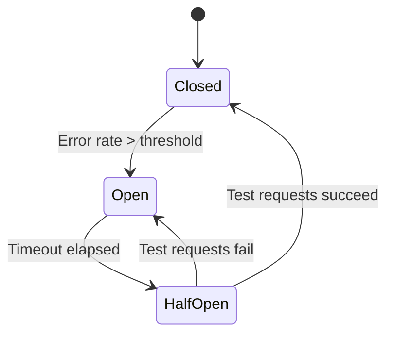

Retrieve the current status of the circuit breaker that protects your inbound webhook from cascading failures. The circuit breaker automatically opens when your webhook experiences high error rates.

## Circuit Breaker States

| State | Description |
|-------|-------------|
| `closed` | Normal operation. All requests go to your webhook. |
| `open` | Webhook failing. Requests use fallback config. Auto-resets after timeout. |
| `half-open` | Testing recovery. Limited requests sent to webhook. |

## Headers

<ParamField header="x-api-key" type="string" required>
  Your TalkOS API key
</ParamField>

<ParamField header="x-tenant-id" type="string" required>
  Your tenant identifier
</ParamField>

## Request

<CodeGroup>
```bash cURL
curl -X GET https://api.talkos.io/api/inbound/circuit-breaker/status \
  -H "x-api-key: your-api-key" \
  -H "x-tenant-id: your-tenant-id"
```

```javascript Node.js
const response = await fetch('https://api.talkos.io/api/inbound/circuit-breaker/status', {
  method: 'GET',
  headers: {
    'x-api-key': 'your-api-key',
    'x-tenant-id': 'your-tenant-id'
  }
});

const data = await response.json();
```

```python Python
import requests

response = requests.get(
    'https://api.talkos.io/api/inbound/circuit-breaker/status',
    headers={
        'x-api-key': 'your-api-key',
        'x-tenant-id': 'your-tenant-id'
    }
)

data = response.json()
```
</CodeGroup>

## Response

<CodeGroup>
```json 200 OK - Closed (Healthy)
{
  "success": true,
  "data": {
    "state": "closed",
    "webhookUrl": "https://your-domain.com/webhooks/talkos-inbound",
    "isHealthy": true,
    "metrics": {
      "windowDurationMs": 60000,
      "totalRequests": 245,
      "successfulRequests": 244,
      "failedRequests": 1,
      "errorRate": 0.41,
      "averageLatencyMs": 138
    },
    "thresholds": {
      "errorRateThreshold": 50,
      "minimumRequests": 10,
      "openDurationMs": 30000
    },
    "lastStateChange": "2026-02-18T08:00:00.000Z",
    "lastSuccessfulRequest": "2026-02-18T15:02:45.000Z",
    "lastFailedRequest": "2026-02-18T14:23:12.000Z"
  }
}
```

```json 200 OK - Open (Unhealthy)
{
  "success": true,
  "data": {
    "state": "open",
    "webhookUrl": "https://your-domain.com/webhooks/talkos-inbound",
    "isHealthy": false,
    "reason": "Error rate exceeded threshold (67% > 50%)",
    "metrics": {
      "windowDurationMs": 60000,
      "totalRequests": 45,
      "successfulRequests": 15,
      "failedRequests": 30,
      "errorRate": 66.67,
      "averageLatencyMs": 4523
    },
    "thresholds": {
      "errorRateThreshold": 50,
      "minimumRequests": 10,
      "openDurationMs": 30000
    },
    "lastStateChange": "2026-02-18T15:01:00.000Z",
    "nextRetryAt": "2026-02-18T15:01:30.000Z",
    "fallbackActive": true,
    "callsUsingFallback": 12,
    "lastSuccessfulRequest": "2026-02-18T14:58:32.000Z",
    "lastFailedRequest": "2026-02-18T15:00:58.000Z",
    "lastError": {
      "code": "ETIMEDOUT",
      "message": "Request timeout after 5000ms"
    }
  }
}
```

```json 200 OK - Half-Open (Testing)
{
  "success": true,
  "data": {
    "state": "half-open",
    "webhookUrl": "https://your-domain.com/webhooks/talkos-inbound",
    "isHealthy": false,
    "reason": "Testing webhook recovery",
    "metrics": {
      "testRequests": 3,
      "testSuccesses": 2,
      "testFailures": 1,
      "requiredSuccesses": 5
    },
    "thresholds": {
      "errorRateThreshold": 50,
      "minimumRequests": 10,
      "openDurationMs": 30000,
      "halfOpenRequests": 5
    },
    "lastStateChange": "2026-02-18T15:01:30.000Z",
    "fallbackActive": true,
    "willCloseAfter": "2 more successful requests"
  }
}
```
</CodeGroup>

## Response Fields

<ResponseField name="data.state" type="string">
  Current circuit breaker state: `closed`, `open`, or `half-open`.
</ResponseField>

<ResponseField name="data.isHealthy" type="boolean">
  Whether incoming calls are being handled by your webhook (true) or fallback (false).
</ResponseField>

<ResponseField name="data.metrics.errorRate" type="number">
  Current error rate percentage within the sliding window.
</ResponseField>

<ResponseField name="data.metrics.averageLatencyMs" type="number">
  Average webhook response time in milliseconds.
</ResponseField>

<ResponseField name="data.thresholds" type="object">
  Configuration thresholds that trigger state changes.
</ResponseField>

<ResponseField name="data.nextRetryAt" type="string">
  When the circuit breaker will attempt to test the webhook (only in `open` state).
</ResponseField>

<ResponseField name="data.fallbackActive" type="boolean">
  Whether calls are currently using fallback configuration.
</ResponseField>

<ResponseField name="data.lastError" type="object">
  Details of the most recent webhook error.
</ResponseField>

## Understanding the Circuit Breaker



<CardGroup cols={2}>
  <Card title="Closed State" icon="circle-check">
    Normal operation. All inbound calls trigger your webhook. Failures are tracked in a sliding window.
  </Card>
  <Card title="Open State" icon="circle-xmark">
    Webhook is failing. All calls use your fallback configuration. Auto-recovers after timeout.
  </Card>
  <Card title="Half-Open State" icon="circle-half-stroke">
    Recovery testing. A small number of calls are sent to your webhook. Success closes the circuit.
  </Card>
  <Card title="Fallback Active" icon="shield">
    Your fallback configuration handles calls during open/half-open states.
  </Card>
</CardGroup>

<Tip>
  Monitor circuit breaker status in your observability stack. Set up alerts when state changes to `open` to quickly identify webhook issues.
</Tip>
