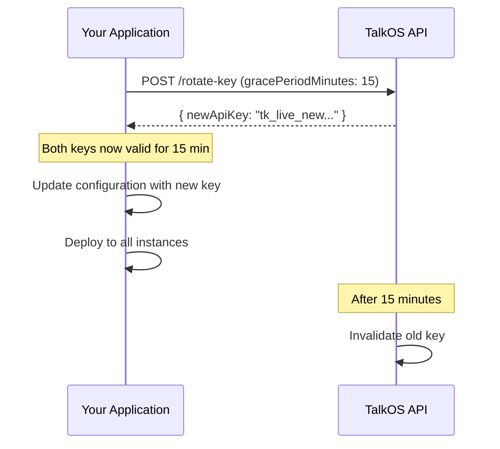

# Rotate API Key

Generates a new API key for the tenant and immediately invalidates the old one. Use this when you suspect your API key has been compromised, when rotating keys as part of security best practices, or when an employee with access leaves your organization.

## Endpoint

```
POST https://api.talkos.io/api/tenants/:tenantId/rotate-key
```

## Headers

<ParamField header="Content-Type" type="string" required default="application/json">
  Must be `application/json`
</ParamField>

<ParamField header="x-api-key" type="string" required>
  Your current tenant API key. This key will be invalidated after rotation.
  
  **Example:** `tk_live_abc123xyz789`
</ParamField>

<ParamField header="x-tenant-id" type="string" required>
  The tenant identifier.
  
  **Example:** `tenant_01HXYZ123456`
</ParamField>

## Path Parameters

<ParamField path="tenantId" type="string" required>
  The unique identifier of the tenant whose API key should be rotated.
  
  **Example:** `tenant_01HXYZ123456`
</ParamField>

## Request Body

<ParamField body="reason" type="string">
  Optional reason for the key rotation. This will be logged in the audit trail.
  
  **Example:** `"Security best practice - quarterly rotation"`
</ParamField>

<ParamField body="gracePeriodMinutes" type="integer" default="0">
  Number of minutes to keep the old key valid alongside the new one. Useful for zero-downtime rotations.
  
  - Minimum: `0` (immediate invalidation)
  - Maximum: `60`
  
  **Example:** `15`
</ParamField>

<ParamField body="notifyEmail" type="boolean" default="true">
  Whether to send an email notification about the key rotation.
  
  **Default:** `true`
</ParamField>

## Response

<ResponseField name="success" type="boolean">
  Indicates if the rotation was successful.
</ResponseField>

<ResponseField name="data" type="object">
  The rotation result including the new API key.
</ResponseField>

<Expandable title="data properties">
  <ResponseField name="data.newApiKey" type="string">
    The new API key. **Store this securely - it's only shown once.**
    
    **Example:** `"tk_live_newkey123xyz789abc456def"`
  </ResponseField>

  <ResponseField name="data.oldKeyInvalidAt" type="string">
    ISO 8601 timestamp of when the old key will be/was invalidated.
    
    If `gracePeriodMinutes` was 0, this will be the current time.
  </ResponseField>

  <ResponseField name="data.gracePeriodMinutes" type="integer">
    The grace period that was applied.
  </ResponseField>

  <ResponseField name="data.rotatedAt" type="string">
    ISO 8601 timestamp of when the rotation occurred.
  </ResponseField>

  <ResponseField name="data.rotationId" type="string">
    Unique identifier for this rotation event. Useful for audit purposes.
    
    **Example:** `"rot_abc123xyz789"`
  </ResponseField>

  <ResponseField name="data.previousKeyPrefix" type="string">
    First 8 characters of the old key for identification purposes.
    
    **Example:** `"tk_live_a"`
  </ResponseField>
</Expandable>

<ResponseField name="message" type="string">
  A human-readable success message.
</ResponseField>

## Example Request

<CodeGroup>

```bash cURL
curl -X POST https://api.talkos.io/api/tenants/tenant_01HXYZ123456/rotate-key \
  -H "Content-Type: application/json" \
  -H "x-api-key: tk_live_abc123xyz789" \
  -H "x-tenant-id: tenant_01HXYZ123456" \
  -d '{
    "reason": "Security best practice - quarterly rotation",
    "gracePeriodMinutes": 15,
    "notifyEmail": true
  }'
```

```javascript Node.js
const response = await fetch(
  'https://api.talkos.io/api/tenants/tenant_01HXYZ123456/rotate-key',
  {
    method: 'POST',
    headers: {
      'Content-Type': 'application/json',
      'x-api-key': 'tk_live_abc123xyz789',
      'x-tenant-id': 'tenant_01HXYZ123456'
    },
    body: JSON.stringify({
      reason: 'Security best practice - quarterly rotation',
      gracePeriodMinutes: 15,
      notifyEmail: true
    })
  }
);

const data = await response.json();

// Immediately update your configuration with the new key
console.log('New API Key:', data.data.newApiKey);
// Store this securely in your secrets manager
```

```python Python
import requests

response = requests.post(
    'https://api.talkos.io/api/tenants/tenant_01HXYZ123456/rotate-key',
    headers={
        'Content-Type': 'application/json',
        'x-api-key': 'tk_live_abc123xyz789',
        'x-tenant-id': 'tenant_01HXYZ123456'
    },
    json={
        'reason': 'Security best practice - quarterly rotation',
        'gracePeriodMinutes': 15,
        'notifyEmail': True
    }
)

data = response.json()

# Immediately update your configuration with the new key
print('New API Key:', data['data']['newApiKey'])
# Store this securely in your secrets manager
```

</CodeGroup>

## Example Response

```json
{
  "success": true,
  "data": {
    "newApiKey": "tk_live_newkey123xyz789abc456def012ghi",
    "oldKeyInvalidAt": "2026-02-18T15:00:00.000Z",
    "gracePeriodMinutes": 15,
    "rotatedAt": "2026-02-18T14:45:00.000Z",
    "rotationId": "rot_abc123xyz789",
    "previousKeyPrefix": "tk_live_a"
  },
  "message": "API key rotated successfully. Old key valid until 2026-02-18T15:00:00.000Z"
}
```

## Example Response (Immediate Invalidation)

```json
{
  "success": true,
  "data": {
    "newApiKey": "tk_live_newkey123xyz789abc456def012ghi",
    "oldKeyInvalidAt": "2026-02-18T14:45:00.000Z",
    "gracePeriodMinutes": 0,
    "rotatedAt": "2026-02-18T14:45:00.000Z",
    "rotationId": "rot_def456uvw012",
    "previousKeyPrefix": "tk_live_a"
  },
  "message": "API key rotated successfully. Old key has been invalidated immediately."
}
```

## Error Responses

<CodeGroup>

```json 401 - Unauthorized
{
  "success": false,
  "error": {
    "code": "INVALID_API_KEY",
    "message": "Invalid or missing API key",
    "details": {}
  },
  "requestId": "req_abc123xyz789"
}
```

```json 403 - Forbidden
{
  "success": false,
  "error": {
    "code": "ACCESS_DENIED",
    "message": "You do not have permission to rotate keys for this tenant",
    "details": {}
  },
  "requestId": "req_def456uvw012"
}
```

```json 404 - Not Found
{
  "success": false,
  "error": {
    "code": "TENANT_NOT_FOUND",
    "message": "Tenant not found",
    "details": {
      "tenantId": "tenant_nonexistent"
    }
  },
  "requestId": "req_ghi789rst345"
}
```

```json 429 - Rate Limited
{
  "success": false,
  "error": {
    "code": "ROTATION_RATE_LIMITED",
    "message": "API key rotation is rate limited. Please wait before rotating again.",
    "details": {
      "nextAllowedRotation": "2026-02-18T15:45:00.000Z",
      "cooldownMinutes": 60
    }
  },
  "requestId": "req_jkl012mno678"
}
```

</CodeGroup>

## Zero-Downtime Rotation

For production systems, use the `gracePeriodMinutes` parameter to perform zero-downtime key rotation:



### Best Practices for Zero-Downtime Rotation

1. **Request rotation with grace period**
   ```bash
   curl -X POST .../rotate-key -d '{"gracePeriodMinutes": 15}'
   ```

2. **Update your secrets manager** with the new key

3. **Deploy configuration** to all application instances

4. **Verify** the new key works before grace period expires

5. **Monitor** for any requests still using the old key

## Security Best Practices

<Warning>
  **Immediate Action Required**: After rotating your API key, immediately update all systems that use the old key. Any requests with the old key will fail after the grace period expires (or immediately if no grace period was set).
</Warning>

<Tip>
  **Recommended Rotation Schedule**: Rotate your API keys at least quarterly as a security best practice, and immediately if you suspect a key has been compromised.
</Tip>

<Note>
  **Audit Trail**: All key rotations are logged in your audit trail. You can view the history in your dashboard under **Settings** → **Security** → **API Key History**.
</Note>

### When to Rotate Keys

- **Quarterly** as part of routine security hygiene
- **Employee departure** who had access to keys
- **Security incident** or suspected compromise
- **After fixing** a code leak or misconfiguration
- **Environment separation** when moving from staging to production

### Storing Keys Securely

Never store API keys in:
- Source code
- Git repositories
- Client-side applications
- Unencrypted configuration files

Use secure alternatives:
- Environment variables
- Secrets managers (AWS Secrets Manager, HashiCorp Vault, etc.)
- Encrypted configuration systems

## Related Endpoints

- [Create Tenant](/api-reference/tenant/create-tenant) - Initial API key is provided during tenant creation
- [Get Tenant](/api-reference/tenant/get-tenant) - View tenant details (API key is never returned)
