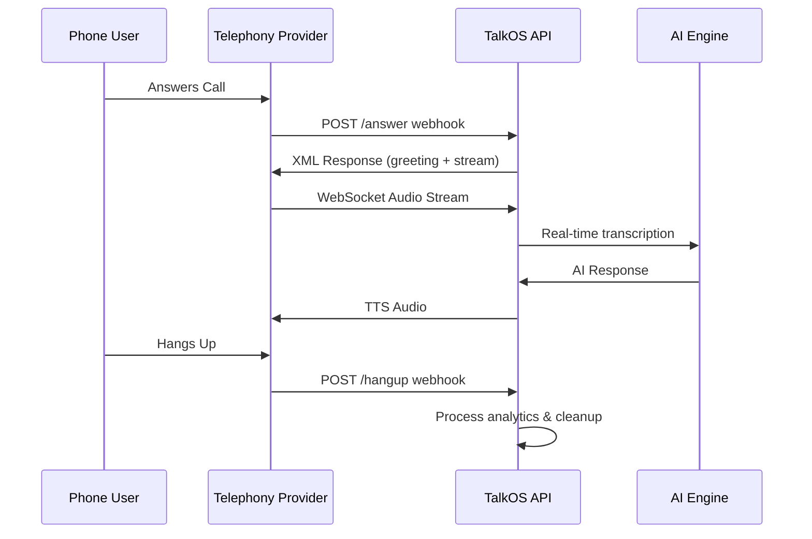

TalkOS integrates with multiple telephony providers (Plivo, Exotel) and uses webhooks to handle real-time call events. These webhooks are automatically triggered by the telephony provider when call state changes occur.

## Supported Providers

<CardGroup cols={2}>
  <Card title="Plivo" icon="phone">
    Full support for Plivo's voice API including audio streaming via WebSocket.
  </Card>
  <Card title="Exotel" icon="phone-office">
    Support for Exotel's voice platform with status callbacks.
  </Card>
</CardGroup>

## Webhook Flow



## Webhook Endpoints

| Provider | Event | Endpoint |
|----------|-------|----------|
| Plivo | Call Answered | `POST /api/calls/plivo/answer` |
| Plivo | Call Ended | `POST /api/calls/plivo/hangup` |
| Exotel | Status Callback | `POST /api/calls/exotel/status` |

## Configuration

### Plivo Setup

When configuring your Plivo application, set the following URLs:

```
Answer URL:     https://api.talkos.io/api/calls/plivo/answer
Hangup URL:     https://api.talkos.io/api/calls/plivo/hangup
```

### Exotel Setup

Configure your Exotel application with:

```
Status Callback URL: https://api.talkos.io/api/calls/exotel/status
```

## Webhook Security

<Warning>
Webhook endpoints should be configured to only accept requests from your telephony provider's IP ranges. Configure firewall rules accordingly.
</Warning>

### IP Whitelisting

For production deployments, restrict webhook access to provider IP ranges:

- **Plivo**: See [Plivo IP Addresses](https://www.plivo.com/docs/voice/concepts/firewall-configuration/)
- **Exotel**: Contact Exotel support for IP ranges

## Error Handling

TalkOS webhooks always return a `200 OK` status to acknowledge receipt. This prevents the telephony provider from retrying the webhook, which could cause duplicate events.

Internal errors are logged and handled asynchronously without affecting the call flow.

## Call States

| State | Description |
|-------|-------------|
| `queued` | Call is queued for processing |
| `ringing` | Call is ringing on recipient's phone |
| `answered` | Call was answered, conversation active |
| `completed` | Call ended normally |
| `failed` | Call failed to connect |
| `busy` | Recipient was busy |
| `no-answer` | Recipient didn't answer |
