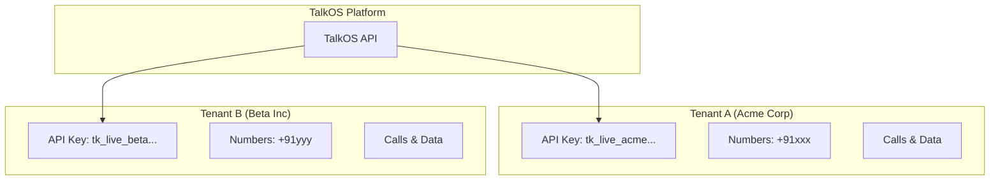
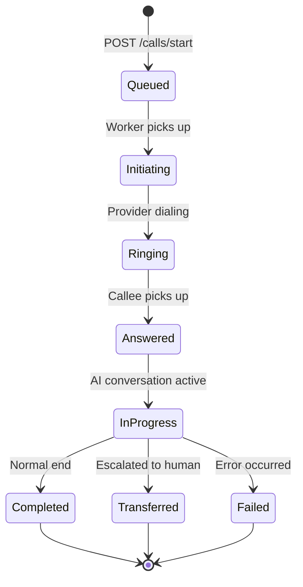
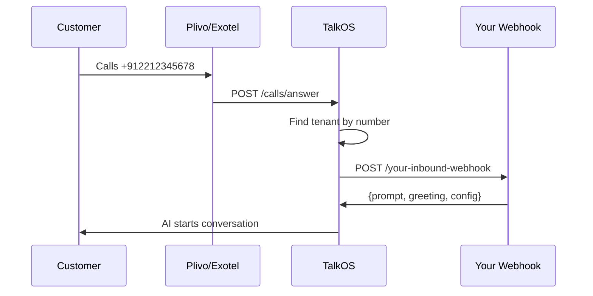
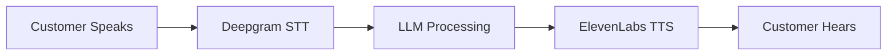
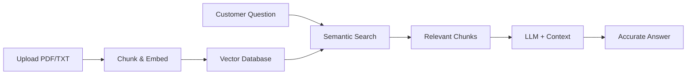

## Multi-Tenancy

TalkOS is built for **multi-tenant SaaS applications**. Each organization (your customer) operates as an isolated tenant.



### Tenant Isolation

| Resource | Isolation Level |
|----------|-----------------|
| API Keys | Unique per tenant |
| Phone Numbers | Owned by tenant |
| Call Records | Tenant-scoped |
| Knowledge Bases | Tenant-scoped |
| Analytics | Tenant-filtered |
| Configurations | Per-tenant settings |

## Call Lifecycle

Every call in TalkOS follows this lifecycle:



### Call Statuses

| Status | Description |
|--------|-------------|
| `queued` | Call request received, waiting in queue |
| `initiating` | Worker processing, about to dial |
| `ringing` | Phone is ringing |
| `answered` | Call connected, AI active |
| `in-progress` | Active conversation |
| `completed` | Call ended normally |
| `failed` | Call failed (busy, no answer, error) |
| `transferred` | Call handed off to human agent |

## Outbound vs Inbound Calls

### Outbound Calls

Your system initiates the call to the customer.

```bash
POST /api/calls/start
{
  "to": "+919876543210",      # Customer's number
  "from": "+912212345678",    # Your bot number
  "prompt": "You are a sales assistant..."
}
```

### Inbound Calls

Customer calls your bot number. TalkOS:
1. Receives the call via Plivo/Exotel webhook
2. Looks up which tenant owns the number
3. Fetches call config from tenant's webhook
4. Starts AI conversation



## AI Conversation Engine

### How It Works

1. **Speech-to-Text**: Deepgram transcribes customer speech in real-time
2. **AI Processing**: LLM (GPT-4/Claude/Groq) generates response
3. **Text-to-Speech**: ElevenLabs converts response to audio
4. **Streaming**: Audio streams back to customer



### Conversation Context

The AI maintains context throughout the call:

```json
{
  "systemPrompt": "You are a sales assistant for Acme Corp...",
  "conversationHistory": [
    { "role": "assistant", "content": "Hello! How can I help?" },
    { "role": "user", "content": "I want to know about pricing" },
    { "role": "assistant", "content": "Our plans start at $99/month..." }
  ],
  "tools": [
    { "name": "check_inventory", "description": "..." },
    { "name": "schedule_demo", "description": "..." }
  ]
}
```

## Tool Calling (Function Calling)

AI can execute functions during calls:

```json
{
  "prompt": "You are a support agent. Use tools to help customers.",
  "tools": [
    {
      "name": "check_order_status",
      "description": "Check the status of a customer order",
      "parameters": {
        "type": "object",
        "properties": {
          "orderId": { "type": "string", "description": "Order ID" }
        },
        "required": ["orderId"]
      },
      "endpoint": "https://your-api.com/orders/{orderId}"
    }
  ]
}
```

When customer says "What's the status of order ORD-123?", the AI:
1. Recognizes intent matches `check_order_status`
2. Extracts `orderId = "ORD-123"`
3. Calls your endpoint
4. Incorporates response into conversation

## Knowledge Base (RAG)

Upload documents and let AI answer questions from them:



## Real-Time Features

### Live Transcription

WebSocket connection for real-time transcript:

```javascript
const ws = new WebSocket('wss://api.talkos.io/ws/realtime');
ws.send(JSON.stringify({ 
  type: 'subscribe', 
  callUuid: 'call_xyz789' 
}));

ws.onmessage = (event) => {
  const data = JSON.parse(event.data);
  // { type: 'transcript', role: 'user', text: 'Hello...' }
};
```

### Live Coaching

Supervisors can send messages to agents during calls:

```bash
POST /api/coaching/start
{
  "callUuid": "call_xyz789",
  "supervisorId": "supervisor_001"
}
```

## Webhooks

TalkOS sends events to your webhook URL:

| Event | When |
|-------|------|
| `call.started` | Call connected |
| `call.transcript` | New transcript segment |
| `call.tool_called` | AI executed a tool |
| `call.transferred` | Call transferred to human |
| `call.completed` | Call ended |

### Webhook Payload

```json
{
  "event": "call.completed",
  "timestamp": "2025-02-18T00:00:00.000Z",
  "callUuid": "call_xyz789",
  "tenantId": "tenant_abc123",
  "data": {
    "duration": 127,
    "status": "completed",
    "transcript": [...],
    "summary": "...",
    "sentiment": { "overall": "positive", "score": 0.85 }
  }
}
```

## Rate Limiting & Queuing

### Call Queue

Calls are processed through a Redis-backed queue:

```
[Request] → [Queue] → [Worker] → [Provider] → [AI] → [Customer]
```

- **Concurrency**: 5 simultaneous calls per worker
- **Rate Limit**: 10 calls per minute per tenant (configurable)
- **Retry**: Failed calls retry up to 2 times

### API Rate Limits

| Endpoint | Limit |
|----------|-------|
| `POST /calls/start` | 10/minute |
| `POST /calls/batch/start` | 5/minute |
| `GET` endpoints | 100/minute |
| `POST` endpoints (other) | 60/minute |

## Data Retention

| Data Type | Retention |
|-----------|-----------|
| Call Records | 90 days (configurable) |
| Transcripts | 90 days |
| Analytics | 1 year |
| Audit Logs | 2 years |

Configure retention per tenant via GDPR compliance APIs.
