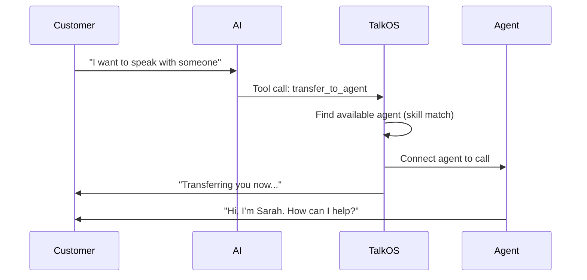

## Overview

TalkOS lets you manage human agents alongside AI. Register agents, transfer AI calls to humans (warm or cold), coach agents in real-time, and monitor everything from a supervisor dashboard.

---

## Agent Registration

### Register an Agent

```bash
curl -X POST https://api.talkos.io/api/transfer/agents \
  -H "x-api-key: YOUR_KEY" \
  -H "X-Tenant-ID: YOUR_TENANT" \
  -d '{
    "agentId": "agent-001",
    "name": "Sarah Johnson",
    "phoneNumber": "+14155551234",
    "skills": ["billing", "technical", "returns"],
    "priority": 1,
    "maxConcurrentCalls": 3,
    "availability": {
      "schedule": "weekdays",
      "timezone": "America/New_York",
      "hours": { "start": "09:00", "end": "17:00" }
    }
  }'
```

### List Agents

```bash
curl https://api.talkos.io/api/transfer/agents \
  -H "x-api-key: YOUR_KEY" \
  -H "X-Tenant-ID: YOUR_TENANT"
```

### Update Agent

```bash
curl -X PUT https://api.talkos.io/api/transfer/agents/agent-001 \
  -H "x-api-key: YOUR_KEY" \
  -H "X-Tenant-ID: YOUR_TENANT" \
  -d '{
    "skills": ["billing", "technical", "returns", "spanish"],
    "maxConcurrentCalls": 5
  }'
```

### Set Agent Availability

```bash
curl -X PUT https://api.talkos.io/api/transfer/agents/agent-001/availability \
  -H "x-api-key: YOUR_KEY" \
  -H "X-Tenant-ID: YOUR_TENANT" \
  -d '{ "available": true }'
```

### Remove Agent

```bash
curl -X DELETE https://api.talkos.io/api/transfer/agents/agent-001 \
  -H "x-api-key: YOUR_KEY" \
  -H "X-Tenant-ID: YOUR_TENANT"
```

---

## Call Transfer

Transfer active AI calls to human agents when the AI determines it needs human help or the customer requests it.

### Transfer Flow



### Initiate Transfer

```bash
curl -X POST https://api.talkos.io/api/transfer/initiate \
  -H "x-api-key: YOUR_KEY" \
  -H "X-Tenant-ID: YOUR_TENANT" \
  -d '{
    "callUuid": "call-uuid-123",
    "targetAgentId": "agent-001",
    "transferType": "warm",
    "reason": "Customer requested human agent",
    "context": {
      "summary": "Customer asking about refund for order #12345",
      "sentiment": "frustrated",
      "keyInfo": ["Order #12345", "Premium subscriber", "3rd call about this issue"]
    }
  }'
```

### Transfer Types

| Type | Description | Best For |
|------|-------------|----------|
| `warm` | AI briefs agent before connecting | Complex issues, VIP customers |
| `cold` | Direct connect to agent | Simple transfers, customer request |
| `queue` | Put in agent queue | High volume, no agent available |

### Check Transfer Status

```bash
curl https://api.talkos.io/api/transfer/status/call-uuid-123 \
  -H "x-api-key: YOUR_KEY" \
  -H "X-Tenant-ID: YOUR_TENANT"
```

### Cancel Transfer

```bash
curl -X POST https://api.talkos.io/api/transfer/cancel/call-uuid-123 \
  -H "x-api-key: YOUR_KEY" \
  -H "X-Tenant-ID: YOUR_TENANT"
```

---

## AI-Triggered Transfer (Tool Calling)

Configure your AI agent to transfer calls automatically:

```bash
curl -X POST https://api.talkos.io/api/calls/initiate \
  -d '{
    "to": "+14155551234",
    "systemPrompt": "You are a support agent. If the customer asks to speak to a human, or if you cannot resolve their issue after 3 attempts, use the transfer_to_agent tool.",
    "tools": [
      {
        "type": "function",
        "function": {
          "name": "transfer_to_agent",
          "description": "Transfer the call to a human agent",
          "parameters": {
            "type": "object",
            "properties": {
              "reason": { "type": "string" },
              "department": { "type": "string", "enum": ["billing", "technical", "sales"] }
            }
          }
        }
      }
    ]
  }'
```

---

## Live Coaching

Supervisors can send real-time guidance to AI agents during active calls:

### Send Coaching Message

```bash
curl -X POST https://api.talkos.io/api/realtime/coach \
  -H "x-api-key: YOUR_KEY" \
  -H "X-Tenant-ID: YOUR_TENANT" \
  -d '{
    "callUuid": "call-uuid-123",
    "message": "Offer the 20% discount code SAVE20 — this customer is a VIP",
    "priority": "high"
  }'
```

The AI will incorporate the coaching message into its next response naturally.

### Monitor Active Calls

```bash
curl https://api.talkos.io/api/realtime/active-calls \
  -H "x-api-key: YOUR_KEY" \
  -H "X-Tenant-ID: YOUR_TENANT"
```

### Live Transcription Stream

```bash
curl https://api.talkos.io/api/realtime/transcript/call-uuid-123 \
  -H "x-api-key: YOUR_KEY" \
  -H "X-Tenant-ID: YOUR_TENANT"
```

### Update AI Prompt Mid-Call

```bash
curl -X POST https://api.talkos.io/api/realtime/update-prompt \
  -H "x-api-key: YOUR_KEY" \
  -H "X-Tenant-ID: YOUR_TENANT" \
  -d '{
    "callUuid": "call-uuid-123",
    "newSystemPrompt": "Be more empathetic. The customer is upset about their delayed order."
  }'
```

### Barge-In

```bash
curl -X POST https://api.talkos.io/api/realtime/barge-in \
  -H "x-api-key: YOUR_KEY" \
  -H "X-Tenant-ID: YOUR_TENANT" \
  -d '{
    "callUuid": "call-uuid-123",
    "action": "take_over",
    "agentId": "supervisor-001"
  }'
```

---

## Supervisor Dashboard

### WebSocket Connection

For real-time updates, connect to the supervisor WebSocket:

```javascript
const ws = new WebSocket('wss://api.talkos.io/supervisor-dashboard');

ws.onopen = () => {
  // Authenticate
  ws.send(JSON.stringify({ type: 'auth', token: 'admin-jwt-token' }));
};

ws.onmessage = (event) => {
  const data = JSON.parse(event.data);
  switch (data.type) {
    case 'call_started':
      addCallToBoard(data.call);
      break;
    case 'call_ended':
      removeFromBoard(data.callUuid);
      break;
    case 'sentiment_alert':
      showAlert(data.callUuid, data.sentiment);
      break;
    case 'transfer_requested':
      showTransferRequest(data);
      break;
  }
};
```

### Agent Performance Stats

```bash
curl https://api.talkos.io/api/realtime/agent-stats \
  -H "x-api-key: YOUR_KEY"
```

Returns per-agent metrics: calls handled, average duration, transfers, customer satisfaction.

---

## Building Agent Dashboard UIs

### Agent View Components

| Component | Data Source | Update Frequency |
|-----------|-----------|-----------------|
| My Active Calls | `GET /api/realtime/active-calls` | WebSocket real-time |
| Call Queue | `GET /api/calls/queue` | Every 5s |
| My Performance | `GET /api/realtime/agent-stats` | Every 30s |
| Incoming Transfer | WebSocket `transfer_requested` | Real-time |
| Customer History | `GET /api/analytics/calls` | On transfer accept |

### Supervisor View Components

| Component | Data Source | Update Frequency |
|-----------|-----------|-----------------|
| All Active Calls | `GET /api/realtime/active-calls` | WebSocket real-time |
| Agent Board | `GET /api/transfer/agents` | Every 10s |
| Live Transcripts | `GET /api/realtime/transcript/:id` | Real-time |
| Sentiment Heatmap | `GET /api/analytics/sentiment` | Every 15s |
| Coaching Panel | `POST /api/realtime/coach` | On action |
| Volume Forecast | `GET /api/features/predictions/forecast` | Hourly |

<Tip>
Use WebSocket connections for all real-time dashboard components. Poll REST APIs only for historical data or when WebSocket is unavailable.
</Tip>
