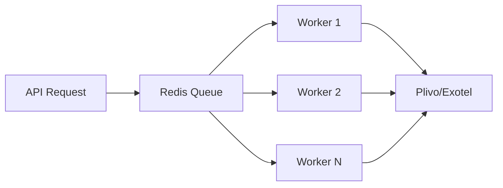
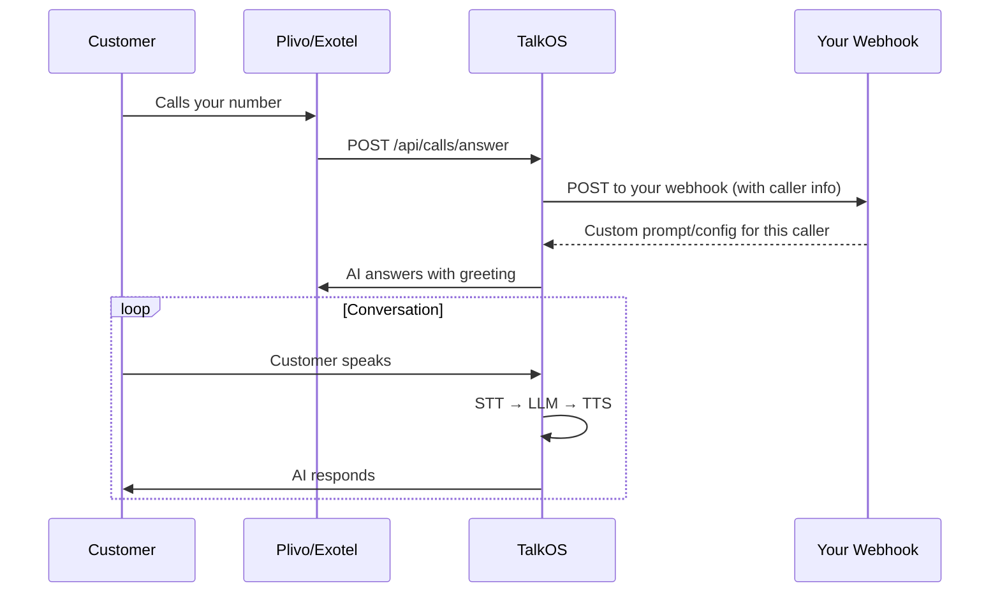

## Overview

TalkOS supports both **outbound** (you call the customer) and **inbound** (customer calls you) voice AI. Both flows use the same AI engine, same prompts, same analytics — just different initiation methods.

---

## Outbound Calling

### Single Call

Queue a single AI-powered call:

```bash
curl -X POST https://api.talkos.io/api/calls/start \
  -H "x-api-key: YOUR_KEY" \
  -H "X-Tenant-ID: YOUR_TENANT" \
  -H "Content-Type: application/json" \
  -d '{
    "to": "+15551234567",
    "prompt": "You are a friendly appointment reminder from Dr. Smith office.",
    "greeting": "Hello! This is a reminder about your upcoming appointment.",
    "maxDuration": 120,
    "language": "en",
    "voiceId": "JBFqnCBsd6RMkjVDRZzb",
    "webhookUrl": "https://your-server.com/call-completed",
    "metadata": {
      "patientId": "P-12345",
      "appointmentDate": "2026-02-20",
      "appointmentTime": "10:00 AM"
    }
  }'
```

**Response (202 Accepted):**
```json
{
  "success": true,
  "data": {
    "jobId": "job_abc123",
    "to": "+15551234567",
    "status": "queued",
    "queuePosition": 1,
    "jobStatusUrl": "/api/calls/queue/job_abc123"
  }
}
```

### Call Parameters

| Parameter | Type | Required | Description |
|-----------|------|:--------:|-------------|
| `to` | string | Yes | Phone number in E.164 format |
| `prompt` | string | No | AI behavior instructions |
| `greeting` | string | No | First thing AI says when answered |
| `maxDuration` | number | No | Max call length in seconds (default: 300) |
| `language` | string | No | Language code (default: "en") |
| `voiceId` | string | No | ElevenLabs voice ID |
| `speed` | number | No | Speech speed 0.5-2.0 |
| `webhookUrl` | string | No | URL for completion callback |
| `metadata` | object | No | Custom data attached to call |
| `priority` | string | No | "low", "normal", "high" |
| `tools` | array | No | AI function calling tools |
| `knowledgeBaseId` | string | No | Knowledge base for RAG |
| `recording` | boolean | No | Record the call |
| `voicemail` | object | No | Voicemail detection config |
| `dtmf` | object | No | DTMF/keypad input config |
| `guardrails` | object | No | Content safety rules |
| `scoring` | object | No | Call scoring criteria |

---

### Batch Calling

Send up to **1,000 calls** in a single API request:

```bash
curl -X POST https://api.talkos.io/api/calls/batch/start \
  -H "x-api-key: YOUR_KEY" \
  -H "X-Tenant-ID: YOUR_TENANT" \
  -d '{
    "calls": [
      {
        "to": "+15551234567",
        "prompt": "Reminder: Your package arrives tomorrow.",
        "metadata": {"orderId": "ORD-001"}
      },
      {
        "to": "+15559876543",
        "prompt": "Reminder: Your subscription renews next week.",
        "metadata": {"orderId": "ORD-002"}
      }
    ],
    "webhookUrl": "https://your-server.com/batch-completed",
    "priority": "high"
  }'
```

**Response:**
```json
{
  "batchId": "batch_xyz789",
  "totalRequested": 2,
  "successful": 2,
  "failed": 0,
  "results": [
    {"to": "+15551234567", "jobId": "job_001", "status": "queued"},
    {"to": "+15559876543", "jobId": "job_002", "status": "queued"}
  ]
}
```

### Check Batch Status

```bash
curl https://api.talkos.io/api/batch/batch_xyz789/status \
  -H "x-api-key: YOUR_KEY" \
  -H "X-Tenant-ID: YOUR_TENANT"
```

---

### Queue System

Calls are processed through a Redis-backed queue (BullMQ):



| Setting | Default | Description |
|---------|---------|-------------|
| Concurrency | 5 | Max simultaneous calls per worker |
| Rate Limit | 10/60s | Max calls per minute per worker |
| Retries | 2 | Retry failed calls |
| Backoff | Exponential | Increasing delay between retries |

### Check Queue Status

```bash
curl https://api.talkos.io/api/calls/queue \
  -H "x-api-key: YOUR_KEY" \
  -H "X-Tenant-ID: YOUR_TENANT"
```

---

## Inbound Calling

Configure TalkOS to answer incoming calls with AI:

### Step 1: Configure Inbound Webhook

```bash
curl -X POST https://api.talkos.io/api/inbound/config \
  -H "x-api-key: YOUR_KEY" \
  -H "X-Tenant-ID: YOUR_TENANT" \
  -d '{
    "webhookUrl": "https://your-server.com/api/inbound/handler",
    "webhookTimeoutMs": 5000,
    "fallbackConfig": {
      "prompt": "You are a helpful support agent for Acme Corp. Answer questions about products, pricing, and orders.",
      "greeting": "Thank you for calling Acme Corp! How can I help you today?",
      "maxDuration": 600,
      "language": "en",
      "voiceId": "JBFqnCBsd6RMkjVDRZzb"
    }
  }'
```

### Step 2: Point Your Phone Number to TalkOS

In your Plivo/Exotel dashboard, set the answer URL for your number to:
```
https://your-talkos-server.com/api/calls/answer
```

### How Inbound Works



### Your Webhook Response

Your webhook can return custom AI configuration per caller:

```json
{
  "prompt": "Customer John Doe is calling about order ORD-12345. He has premium support.",
  "greeting": "Hello John! I see you're calling about your recent order. How can I help?",
  "language": "en",
  "voiceId": "custom-voice-id",
  "tools": [...],
  "knowledgeBaseId": "kb-support"
}
```

If your webhook fails or times out, TalkOS uses the fallback config you configured.

### Circuit Breaker

TalkOS includes a circuit breaker for your inbound webhook:

```bash
# Check circuit breaker status
curl https://api.talkos.io/api/inbound/circuit-breaker/status

# Reset if stuck open
curl -X POST https://api.talkos.io/api/inbound/circuit-breaker/reset
```

---

## Webhooks (Your Callbacks)

### Call Events

Set `webhookUrl` when starting a call to receive status updates:

```json
// POST to your webhookUrl
{
  "event": "call.completed",
  "callUuid": "call-uuid-123",
  "to": "+15551234567",
  "duration": 120,
  "status": "completed",
  "hangupCause": "normalClearing",
  "sentiment": 0.7,
  "turns": 8,
  "transcript": [...],
  "metadata": {"orderId": "ORD-001"}
}
```

### Plivo/Exotel Provider Webhooks

TalkOS handles provider webhooks automatically:

| Webhook | Path | Trigger |
|---------|------|---------|
| Answer | `/api/calls/answer` | Call is answered |
| Hangup | `/api/calls/hangup` | Call ends |
| Ringing | `/api/calls/ringing` | Phone is ringing |
| Stream Status | `/api/calls/stream-status` | Audio stream events |
| Exotel Status | `/api/calls/exotel/status-callback` | Exotel call events |

---

## Monitoring Calls

### Get Call Status

```bash
curl https://api.talkos.io/api/calls/CALL_UUID/status \
  -H "x-api-key: YOUR_KEY" \
  -H "X-Tenant-ID: YOUR_TENANT"
```

### Real-Time Dashboard

Monitor all active calls in real-time:

```bash
curl https://api.talkos.io/api/analytics/realtime \
  -H "x-api-key: YOUR_KEY" \
  -H "X-Tenant-ID: YOUR_TENANT"
```

Or connect to the supervisor WebSocket:
```
ws://api.talkos.io/supervisor-dashboard?tenantId=YOUR_TENANT
```

---

## Best Practices

<Tip>
1. **Set appropriate maxDuration** — Don't let calls run indefinitely
2. **Use greeting** — First spoken message should be fast and clear
3. **Include metadata** — Helps you match calls to your records
4. **Set up webhookUrl** — Get notified when calls complete
5. **Handle voicemail** — Configure voicemail detection for outbound campaigns
6. **Monitor queue** — Check queue stats before large batch sends
7. **Use priority** — Mark urgent calls as "high" priority
</Tip>
