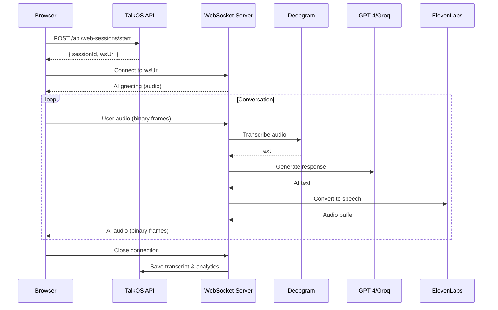

## Overview

Web Sessions let users have AI voice conversations directly in the browser — no phone call needed. Audio streams bidirectionally via WebSocket with ultra-low latency.

**Use cases:**
- Customer support widget on your website
- AI interview practice tool
- Language learning apps
- AI assistant in your SaaS dashboard
- Telehealth consultations

---

## How It Works



---

## Quick Start

### Step 1: Start a Session

```bash
curl -X POST https://api.talkos.io/api/web-sessions/start \
  -H "x-api-key: YOUR_KEY" \
  -H "X-Tenant-ID: YOUR_TENANT" \
  -d '{
    "prompt": "You are a helpful AI assistant for TechStore. Help customers with product questions, order tracking, and returns.",
    "greeting": "Hello! Welcome to TechStore. How can I help you today?",
    "agentName": "TechBot",
    "agentType": "support",
    "maxDuration": 600,
    "language": "en",
    "voiceId": "JBFqnCBsd6RMkjVDRZzb"
  }'
```

**Response:**
```json
{
  "success": true,
  "sessionId": "ws_abc123def",
  "wsUrl": "wss://api.talkos.io/web-session?sessionId=ws_abc123def"
}
```

### Step 2: Connect via WebSocket

```javascript
const ws = new WebSocket('wss://api.talkos.io/web-session?sessionId=ws_abc123def');

// Receive AI audio
ws.onmessage = (event) => {
  if (event.data instanceof Blob) {
    // Play audio
    const audio = new Audio(URL.createObjectURL(event.data));
    audio.play();
  } else {
    // JSON messages (transcript, status, etc.)
    const data = JSON.parse(event.data);
    console.log('Event:', data);
  }
};

// Send user audio from microphone
navigator.mediaDevices.getUserMedia({ audio: true })
  .then(stream => {
    const recorder = new MediaRecorder(stream);
    recorder.ondataavailable = (e) => ws.send(e.data);
    recorder.start(100); // Send chunks every 100ms
  });
```

---

## Session Parameters

| Parameter | Type | Default | Description |
|-----------|------|---------|-------------|
| `prompt` | string | — | AI behavior instructions |
| `greeting` | string | — | First spoken message |
| `agentName` | string | "AI" | Display name for the AI agent |
| `agentType` | string | "general" | "support", "sales", "survey", etc. |
| `maxDuration` | number | 600 | Max session length in seconds |
| `language` | string | "en" | Language code |
| `voiceId` | string | default | ElevenLabs voice ID |
| `speed` | number | 1.0 | Speech speed (0.5-2.0) |
| `pitch` | number | 0 | Voice pitch |
| `tools` | array | — | AI function calling tools |
| `knowledgeBaseId` | string | — | Knowledge base for RAG |
| `guardrails` | object | — | Content safety rules |
| `scoring` | object | — | Session scoring criteria |
| `recording` | boolean | false | Record the session |
| `bargeIn` | boolean | true | Allow interrupting AI |
| `ttsFormat` | string | "mp3_44100_128" | Audio output format |
| `maxHistoryTurns` | number | 10 | Conversation memory length |
| `video` | object | — | Video recording config |

---

## Session Control

### Update Config Mid-Session

```bash
curl -X POST https://api.talkos.io/api/web-sessions/SESSION_ID/config \
  -d '{"voiceId": "new-voice-id", "speed": 1.2}'
```

### Pause & Resume

```bash
# Pause
curl -X POST https://api.talkos.io/api/web-sessions/SESSION_ID/pause

# Resume
curl -X POST https://api.talkos.io/api/web-sessions/SESSION_ID/resume
```

---

## Transcripts

### Get Transcript

```bash
curl https://api.talkos.io/api/web-sessions/SESSION_ID/transcript \
  -H "x-api-key: YOUR_KEY" \
  -H "X-Tenant-ID: YOUR_TENANT"
```

### Export Transcript

```bash
# JSON format
curl https://api.talkos.io/api/web-sessions/SESSION_ID/transcript/export?format=json

# Plain text
curl https://api.talkos.io/api/web-sessions/SESSION_ID/transcript/export?format=text

# CSV
curl https://api.talkos.io/api/web-sessions/SESSION_ID/transcript/export?format=csv
```

---

## Video Recording

Record video alongside voice sessions:

### Get Upload URL

```bash
curl -X POST https://api.talkos.io/api/web-sessions/SESSION_ID/video/upload-url \
  -d '{"chunkIndex": 0}'
```

### Upload Video Chunk

```bash
curl -X POST https://api.talkos.io/api/web-sessions/SESSION_ID/video/upload-local \
  -H "Content-Type: application/octet-stream" \
  --data-binary @video-chunk-0.webm
```

### Video Stats

```bash
curl https://api.talkos.io/api/web-sessions/SESSION_ID/video/stats
```

---

## Search & Analytics

### Search Sessions

```bash
curl "https://api.talkos.io/api/web-sessions/search?status=completed&agentType=support&dateFrom=2026-01-01&limit=20" \
  -H "x-api-key: YOUR_KEY" \
  -H "X-Tenant-ID: YOUR_TENANT"
```

### Session Stats

```bash
curl https://api.talkos.io/api/web-sessions/stats \
  -H "x-api-key: YOUR_KEY" \
  -H "X-Tenant-ID: YOUR_TENANT"
```

---

## Browser Integration Example

Here's a complete example of embedding a TalkOS voice widget:

```html
<div id="voice-widget">
  <button id="start-btn">🎙️ Talk to AI</button>
  <div id="transcript"></div>
</div>

<script>
  let ws, recorder;

  document.getElementById('start-btn').onclick = async () => {
    // 1. Create session via your backend (never expose API keys in frontend)
    const res = await fetch('/api/create-voice-session', { method: 'POST' });
    const { wsUrl } = await res.json();

    // 2. Connect WebSocket
    ws = new WebSocket(wsUrl);
    
    ws.onmessage = (event) => {
      if (event.data instanceof Blob) {
        // Play AI audio
        const audio = new Audio(URL.createObjectURL(event.data));
        audio.play();
      } else {
        const data = JSON.parse(event.data);
        if (data.type === 'transcript') {
          document.getElementById('transcript').innerHTML += 
            `<p><b>${data.role}:</b> ${data.text}</p>`;
        }
      }
    };

    // 3. Capture microphone
    const stream = await navigator.mediaDevices.getUserMedia({ audio: true });
    recorder = new MediaRecorder(stream, { mimeType: 'audio/webm' });
    recorder.ondataavailable = (e) => {
      if (ws.readyState === WebSocket.OPEN) ws.send(e.data);
    };
    recorder.start(100);
  };
</script>
```

---

## Best Practices

<Tip>
1. **Never expose API keys in frontend** — Create sessions via your backend
2. **Use barge-in** — Let users interrupt the AI for natural conversation
3. **Set maxDuration** — Prevent runaway sessions
4. **Handle disconnections** — Implement reconnection logic
5. **Use appropriate audio format** — mp3_44100_128 for browsers
6. **Monitor session stats** — Track duration, sentiment, completion rates
</Tip>
