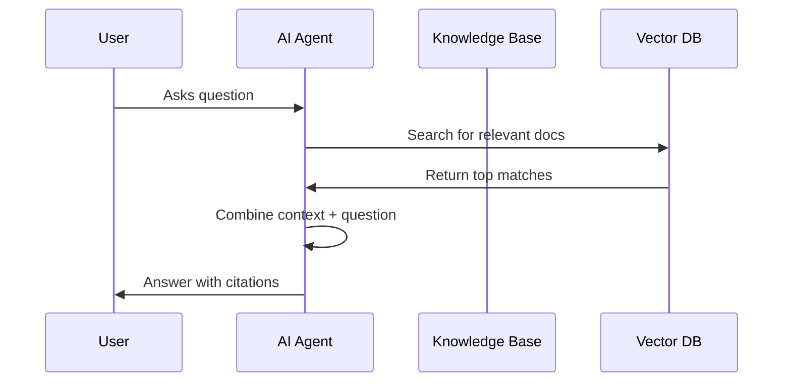

Knowledge bases allow your AI agents to access custom documents, FAQs, and company-specific information during conversations. Using retrieval-augmented generation (RAG), agents can provide accurate, sourced answers instead of relying solely on their training data.

## Why Use Knowledge Bases?

<CardGroup cols={2}>
  <Card title="Accurate Answers" icon="bullseye">
    Ground responses in your actual documentation
  </Card>
  <Card title="Up-to-Date Info" icon="clock">
    Update knowledge without retraining models
  </Card>
  <Card title="Domain Expertise" icon="graduation-cap">
    Add specialized knowledge for your industry
  </Card>
  <Card title="Reduced Hallucination" icon="shield-check">
    Facts come from verified sources
  </Card>
</CardGroup>

## How RAG Works



When a user asks a question:
1. The query is converted to a vector embedding
2. Similar document chunks are retrieved from the knowledge base
3. Relevant context is injected into the AI prompt
4. The AI generates an answer grounded in your documents

<Steps>
  <Step title="Create a Knowledge Base">
    Create a new knowledge base to organize your documents:

    <CodeGroup>

    ```bash cURL
    curl -X POST https://api.talkos.io/api/knowledge-base/create \
      -H "x-api-key: YOUR_API_KEY" \
      -H "Content-Type: application/json" \
      -d '{
        "knowledgeBaseId": "kb-support-001",
        "name": "Customer Support FAQ",
        "description": "Common questions about products, shipping, and returns"
      }'
    ```

    ```javascript Node.js
    const response = await fetch('https://api.talkos.io/api/knowledge-base/create', {
      method: 'POST',
      headers: {
        'x-api-key': 'YOUR_API_KEY',
        'Content-Type': 'application/json'
      },
      body: JSON.stringify({
        knowledgeBaseId: 'kb-support-001',
        name: 'Customer Support FAQ',
        description: 'Common questions about products, shipping, and returns'
      })
    });

    const kb = await response.json();
    console.log('Knowledge Base created:', kb.data.knowledgeBaseId);
    ```

    ```python Python
    import requests

    response = requests.post(
        'https://api.talkos.io/api/knowledge-base/create',
        headers={'x-api-key': 'YOUR_API_KEY'},
        json={
            'knowledgeBaseId': 'kb-support-001',
            'name': 'Customer Support FAQ',
            'description': 'Common questions about products, shipping, and returns'
        }
    )

    kb = response.json()
    print('Knowledge Base created:', kb['data']['knowledgeBaseId'])
    ```

    </CodeGroup>

    ### Response

    ```json
    {
      "success": true,
      "message": "Knowledge base created",
      "data": {
        "knowledgeBaseId": "kb-support-001",
        "tenantId": "tenant_xyz",
        "namespacedId": "tenant_xyz:kb-support-001",
        "name": "Customer Support FAQ",
        "description": "Common questions about products, shipping, and returns",
        "createdAt": "2026-02-18T10:00:00.000Z",
        "status": "ready"
      }
    }
    ```
  </Step>

  <Step title="Upload Documents">
    Add documents to your knowledge base. Documents are automatically chunked and indexed:

    <CodeGroup>

    ```bash cURL
    curl -X POST https://api.talkos.io/api/knowledge-base/upload \
      -H "x-api-key: YOUR_API_KEY" \
      -H "Content-Type: application/json" \
      -d '{
        "knowledgeBaseId": "kb-support-001",
        "content": "# Shipping Policy\n\nWe offer free shipping on all orders over $50. Standard shipping takes 5-7 business days. Express shipping (2-3 days) is available for $9.99. International shipping is available to select countries.\n\n## Returns\n\nItems can be returned within 30 days of purchase. Items must be unused and in original packaging. Refunds are processed within 5-7 business days.",
        "title": "Shipping and Returns Policy",
        "metadata": {
          "source": "policy-docs",
          "category": "shipping",
          "lastUpdated": "2026-02-01"
        }
      }'
    ```

    ```javascript Node.js
    const response = await fetch('https://api.talkos.io/api/knowledge-base/upload', {
      method: 'POST',
      headers: {
        'x-api-key': 'YOUR_API_KEY',
        'Content-Type': 'application/json'
      },
      body: JSON.stringify({
        knowledgeBaseId: 'kb-support-001',
        content: `# Shipping Policy
    
    We offer free shipping on all orders over $50. Standard shipping takes 5-7 business days.
    Express shipping (2-3 days) is available for $9.99.
    
    ## Returns
    
    Items can be returned within 30 days of purchase. Items must be unused and in original packaging.`,
        title: 'Shipping and Returns Policy',
        metadata: {
          source: 'policy-docs',
          category: 'shipping'
        }
      })
    });

    const result = await response.json();
    console.log('Document indexed:', result.data.documentId);
    ```

    ```python Python
    content = """# Shipping Policy

    We offer free shipping on all orders over $50. 
    Standard shipping takes 5-7 business days.
    Express shipping (2-3 days) is available for $9.99.

    ## Returns

    Items can be returned within 30 days of purchase."""

    response = requests.post(
        'https://api.talkos.io/api/knowledge-base/upload',
        headers={'x-api-key': 'YOUR_API_KEY'},
        json={
            'knowledgeBaseId': 'kb-support-001',
            'content': content,
            'title': 'Shipping and Returns Policy',
            'metadata': {
                'source': 'policy-docs',
                'category': 'shipping'
            }
        }
    )

    result = response.json()
    print('Document indexed:', result['data']['documentId'])
    ```

    </CodeGroup>

    ### Response

    ```json
    {
      "success": true,
      "message": "Document indexed successfully",
      "data": {
        "documentId": "doc_abc123",
        "knowledgeBaseId": "kb-support-001",
        "title": "Shipping and Returns Policy",
        "chunks": 3,
        "tokens": 245,
        "indexedAt": "2026-02-18T10:05:00.000Z"
      }
    }
    ```

    <Note>
    Documents are automatically split into chunks for optimal retrieval. Large documents may generate multiple chunks. The `chunks` field indicates how many searchable segments were created.
    </Note>
  </Step>

  <Step title="Bulk Upload Multiple Documents">
    Upload multiple documents at once for efficiency:

    ```javascript bulk-upload.js
    const documents = [
      {
        title: 'Product FAQ',
        content: '# Product FAQ\n\nQ: What sizes are available?\nA: We offer S, M, L, XL...',
        metadata: { category: 'products' }
      },
      {
        title: 'Return Policy',
        content: '# Return Policy\n\nAll items can be returned within 30 days...',
        metadata: { category: 'policies' }
      },
      {
        title: 'Contact Information',
        content: '# Contact Us\n\nEmail: support@acme.com\nPhone: 1-800-ACME...',
        metadata: { category: 'support' }
      }
    ];

    const uploadResults = await Promise.all(
      documents.map(doc =>
        fetch('https://api.talkos.io/api/knowledge-base/upload', {
          method: 'POST',
          headers: {
            'x-api-key': 'YOUR_API_KEY',
            'Content-Type': 'application/json'
          },
          body: JSON.stringify({
            knowledgeBaseId: 'kb-support-001',
            ...doc
          })
        }).then(r => r.json())
      )
    );

    console.log(`Uploaded ${uploadResults.length} documents`);
    ```
  </Step>

  <Step title="Search Your Knowledge Base">
    Test retrieval before using in calls:

    <CodeGroup>

    ```bash cURL
    curl -X POST https://api.talkos.io/api/knowledge-base/search \
      -H "x-api-key: YOUR_API_KEY" \
      -H "Content-Type: application/json" \
      -d '{
        "knowledgeBaseId": "kb-support-001",
        "query": "How long does shipping take?",
        "topK": 3
      }'
    ```

    ```javascript Node.js
    const response = await fetch('https://api.talkos.io/api/knowledge-base/search', {
      method: 'POST',
      headers: {
        'x-api-key': 'YOUR_API_KEY',
        'Content-Type': 'application/json'
      },
      body: JSON.stringify({
        knowledgeBaseId: 'kb-support-001',
        query: 'How long does shipping take?',
        topK: 3
      })
    });

    const results = await response.json();
    results.data.matches.forEach((match, i) => {
      console.log(`${i + 1}. Score: ${match.score.toFixed(3)}`);
      console.log(`   ${match.content.substring(0, 100)}...`);
    });
    ```

    </CodeGroup>

    ### Response

    ```json
    {
      "success": true,
      "data": {
        "query": "How long does shipping take?",
        "matches": [
          {
            "documentId": "doc_abc123",
            "chunkId": "chunk_001",
            "title": "Shipping and Returns Policy",
            "content": "Standard shipping takes 5-7 business days. Express shipping (2-3 days) is available for $9.99.",
            "score": 0.92,
            "metadata": { "category": "shipping" }
          },
          {
            "documentId": "doc_abc123",
            "chunkId": "chunk_002",
            "title": "Shipping and Returns Policy",
            "content": "We offer free shipping on all orders over $50.",
            "score": 0.85,
            "metadata": { "category": "shipping" }
          }
        ]
      }
    }
    ```
  </Step>

  <Step title="Use Knowledge Base in Calls">
    Attach your knowledge base to calls:

    <CodeGroup>

    ```bash cURL
    curl -X POST https://api.talkos.io/api/calls/start \
      -H "x-api-key: YOUR_API_KEY" \
      -H "Content-Type: application/json" \
      -d '{
        "to": "+14155551234",
        "prompt": "You are a customer support agent. Use the knowledge base to answer questions accurately. Always cite your sources.",
        "knowledgeBaseId": "kb-support-001",
        "webhookUrl": "https://your-api.com/webhook"
      }'
    ```

    ```javascript Node.js
    const response = await fetch('https://api.talkos.io/api/calls/start', {
      method: 'POST',
      headers: {
        'x-api-key': 'YOUR_API_KEY',
        'Content-Type': 'application/json'
      },
      body: JSON.stringify({
        to: '+14155551234',
        prompt: `You are a customer support agent. 
                 Use the knowledge base to answer questions accurately.
                 Always cite your sources.`,
        knowledgeBaseId: 'kb-support-001',
        webhookUrl: 'https://your-api.com/webhook'
      })
    });
    ```

    </CodeGroup>

    When the AI receives a question, it will automatically:
    1. Search the knowledge base for relevant context
    2. Include matching content in its reasoning
    3. Generate an answer grounded in your documents
  </Step>
</Steps>

## Managing Knowledge Bases

### List All Knowledge Bases

```bash
curl -X GET https://api.talkos.io/api/knowledge-base \
  -H "x-api-key: YOUR_API_KEY"
```

### Get Knowledge Base Stats

```bash
curl -X GET https://api.talkos.io/api/knowledge-base/kb-support-001/stats \
  -H "x-api-key: YOUR_API_KEY"
```

### Response

```json
{
  "success": true,
  "data": {
    "knowledgeBaseId": "kb-support-001",
    "name": "Customer Support FAQ",
    "totalDocuments": 15,
    "totalChunks": 128,
    "totalTokens": 45230,
    "lastUpdated": "2026-02-18T15:30:00.000Z",
    "searchCount": 1523,
    "avgRetrievalTime": 45
  }
}
```

### Delete a Knowledge Base

<Warning>
Deleting a knowledge base permanently removes all documents and cannot be undone.
</Warning>

```bash
curl -X DELETE https://api.talkos.io/api/knowledge-base/kb-support-001 \
  -H "x-api-key: YOUR_API_KEY"
```

## Best Practices

<AccordionGroup>
  <Accordion title="Document Formatting">
    - Use clear headings and structure (Markdown works great)
    - Keep paragraphs focused on single topics
    - Include Q&A format for frequently asked questions
    - Add metadata for filtering and categorization
  </Accordion>
  
  <Accordion title="Chunking Strategy">
    - TalkOS automatically chunks documents at ~500 tokens
    - Natural section breaks (headings) are preserved
    - Keep related information together when possible
    - Consider uploading large docs as separate smaller docs
  </Accordion>
  
  <Accordion title="Prompt Engineering">
    - Tell the AI to use the knowledge base explicitly
    - Ask for citations or sources when relevant
    - Instruct the AI to say "I don't know" if info isn't found
    - Provide fallback behavior for missing information
  </Accordion>
  
  <Accordion title="Keeping Content Fresh">
    - Re-upload documents when content changes
    - Use metadata.lastUpdated to track versions
    - Consider automated sync from your CMS or docs
    - Periodically review search analytics for gaps
  </Accordion>
</AccordionGroup>

## Example: Support Knowledge Base

```javascript setup-support-kb.js
const API_KEY = process.env.TALKOS_API_KEY;

// Create knowledge base
await fetch('https://api.talkos.io/api/knowledge-base/create', {
  method: 'POST',
  headers: { 'x-api-key': API_KEY, 'Content-Type': 'application/json' },
  body: JSON.stringify({
    knowledgeBaseId: 'kb-support',
    name: 'Customer Support',
    description: 'All support documentation'
  })
});

// Upload FAQ document
const faqContent = `
# Frequently Asked Questions

## Orders

### How do I track my order?
You can track your order by logging into your account and clicking "Order History". 
You'll receive a tracking number via email once your order ships.

### Can I modify my order after placing it?
Orders can be modified within 1 hour of placement. 
Contact support@acme.com or call 1-800-ACME immediately.

### What payment methods do you accept?
We accept Visa, Mastercard, American Express, PayPal, and Apple Pay.

## Shipping

### What are the shipping options?
- Standard: 5-7 business days (free over $50)
- Express: 2-3 business days ($9.99)
- Next Day: 1 business day ($19.99)

### Do you ship internationally?
Yes! We ship to Canada, UK, and EU countries. 
International shipping takes 10-14 business days.

## Returns

### What is your return policy?
Items can be returned within 30 days of purchase. 
Items must be unused and in original packaging.

### How do I start a return?
Email returns@acme.com with your order number. 
We'll send you a prepaid shipping label.
`;

await fetch('https://api.talkos.io/api/knowledge-base/upload', {
  method: 'POST',
  headers: { 'x-api-key': API_KEY, 'Content-Type': 'application/json' },
  body: JSON.stringify({
    knowledgeBaseId: 'kb-support',
    content: faqContent,
    title: 'Customer FAQ',
    metadata: { category: 'faq', version: '2.0' }
  })
});

console.log('Knowledge base ready!');
```
