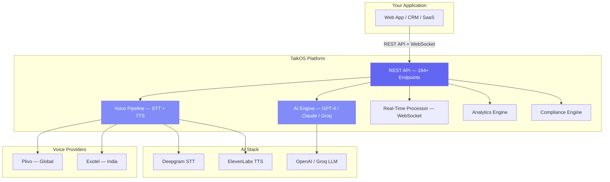

## The AI Voice Platform for Modern Businesses

TalkOS is an **enterprise-grade AI Voice Calling API** that lets you build, deploy, and scale intelligent voice experiences. From automated outbound campaigns to inbound AI receptionists, real-time coaching, and advanced analytics — TalkOS handles the entire voice AI stack so you can focus on your product.

<CardGroup cols={3}>
  <Card title="Quick Start" icon="rocket" href="/quickstart">
    Make your first AI call in **under 5 minutes**
  </Card>
  <Card title="API Reference" icon="code" href="/api-reference/introduction">
    **194+ endpoints** with live playground
  </Card>
  <Card title="Platform Overview" icon="layer-group" href="/platform/overview">
    Architecture, capabilities & how it works
  </Card>
</CardGroup>

---

## Why TalkOS?

<CardGroup cols={2}>
  <Card title="One API, Complete Voice AI" icon="wand-magic-sparkles">
    Stop stitching together Twilio + OpenAI + Deepgram + ElevenLabs. TalkOS wraps everything — dialing, STT, LLM, TTS, analytics — into **one unified API**.
  </Card>
  <Card title="Multi-Tenant by Design" icon="building">
    Built for SaaS platforms. Each tenant gets isolated data, API keys, phone numbers, and usage tracking. **Ship voice AI to your customers**, not just your company.
  </Card>
  <Card title="Production-Ready" icon="shield-check">
    GDPR compliance, PII redaction, voice biometrics, audit logs, circuit breakers, retry logic, rate limiting — all built-in. No shortcuts.
  </Card>
  <Card title="Provider Agnostic" icon="arrows-split-up-and-left">
    Use **Plivo** for global reach or **Exotel** for India. Switch providers without changing a single line of code. Automatic failover included.
  </Card>
</CardGroup>

---

## Platform Capabilities

<AccordionGroup>
  <Accordion title="AI-Powered Voice Conversations" icon="robot" defaultOpen>
    - **Multi-LLM Support**: GPT-4, Claude, Groq (Llama) — with automatic failover
    - **Custom Prompts**: Define AI behavior per call, per tenant, or globally
    - **Tool Calling**: AI can execute real functions during calls (book appointments, check balances, update CRM)
    - **Knowledge Base RAG**: Upload documents, AI answers questions from your data
    - **Voice Cloning**: Clone custom voices for brand-consistent AI agents
    - **28+ Languages**: Hindi, English, Spanish, French, Arabic, and more
  </Accordion>
  
  <Accordion title="Outbound & Inbound Calling" icon="phone">
    - **Single Calls**: Queue individual AI-powered outbound calls
    - **Batch Campaigns**: Send up to 1,000 calls in a single API request
    - **Inbound AI IVR**: Configure AI to answer incoming calls automatically
    - **Webhook-Driven**: Get real-time callbacks for call events
    - **Voicemail Detection**: Automatically detect voicemail and leave messages
    - **DTMF Support**: Handle keypad input during calls
  </Accordion>
  
  <Accordion title="Web Sessions (Browser AI)" icon="globe">
    - **Browser-Based AI Voice**: No phone required — AI voice in the browser via WebSocket
    - **Real-Time Streaming**: Ultra-low latency audio streaming with barge-in support
    - **Video Recording**: Capture video alongside voice sessions
    - **Session Control**: Pause, resume, update config mid-session
    - **Transcript Export**: Download transcripts in JSON, TXT, or CSV
  </Accordion>
  
  <Accordion title="Real-Time Analytics & Dashboard" icon="chart-line">
    - **Live Dashboard**: Monitor active calls, agent status, and queue in real-time
    - **Sentiment Analysis**: Track customer sentiment during and across calls
    - **Call Quality Metrics**: Latency, jitter, audio quality, interruptions
    - **Cost Tracking**: Per-call, per-tenant, per-day cost breakdown
    - **Capacity Planning**: Know when to scale, with concrete recommendations
    - **Predictive Analytics**: Forecast call volumes, churn risk, escalation probability
  </Accordion>
  
  <Accordion title="Agent Management & Coaching" icon="headset">
    - **Agent Registration**: Register live agents with skills and capacity
    - **Smart Transfer**: AI-to-human handoff based on sentiment, keywords, or rules
    - **Live Coaching**: Supervisors send real-time guidance to agents during calls
    - **Supervisor Dashboard**: Bird's-eye view of all active calls and agents
    - **Post-Call Surveys**: Automated IVR/DTMF-based customer feedback
  </Accordion>
  
  <Accordion title="Enterprise Security & Compliance" icon="shield">
    - **PII Detection & Redaction**: Automatically detect and mask SSNs, emails, card numbers
    - **GDPR Compliance**: Built-in data access (SAR) and erasure APIs
    - **Voice Biometrics**: Verify caller identity via voiceprint enrollment
    - **Call Masking**: Hide real phone numbers from agents
    - **Audit Trail**: Every action logged with timestamps and actors
    - **Data Retention**: Automated enforcement of retention policies
    - **Consent Management**: Track recording and data usage consent
  </Accordion>
  
  <Accordion title="Advanced Features" icon="stars">
    - **Escalation Rules Engine**: Define rules for automatic AI-to-human escalation
    - **Call Tagging**: Manual and AI-powered auto-tagging
    - **Hold Music**: Context-aware hold music with custom audio
    - **Chat During Calls**: Internal agent-supervisor messaging
    - **Canned Responses**: Pre-built quick replies for agents
    - **Number Management**: Buy, release, and manage phone numbers via API
  </Accordion>
</AccordionGroup>

---

## Architecture at a Glance



---

## Who Uses TalkOS?

<CardGroup cols={3}>
  <Card title="SaaS Platforms" icon="cloud">
    Add voice AI to your SaaS product with multi-tenant isolation. Each customer gets their own API key, numbers, and analytics.
  </Card>
  <Card title="Contact Centers" icon="headset">
    Automate first-line support with AI. Smart escalation to humans when needed. Real-time coaching for your team.
  </Card>
  <Card title="Healthcare" icon="hospital">
    Appointment reminders, patient follow-ups, prescription refills — all HIPAA-aware with PII redaction.
  </Card>
  <Card title="Sales & Marketing" icon="bullhorn">
    AI-powered outbound campaigns, lead qualification, appointment setting. Batch dial up to 1,000 contacts per request.
  </Card>
  <Card title="Finance & Banking" icon="building-columns">
    Account inquiries, fraud alerts, payment reminders. Voice biometrics for KYC. Complete audit trail.
  </Card>
  <Card title="E-Commerce" icon="truck">
    Order confirmations, delivery updates, return processing. Multi-language support for global operations.
  </Card>
</CardGroup>

---

## Endpoint Coverage

| Category | Endpoints | Description |
|----------|:---------:|-------------|
| Tenant Management | 8 | Create, update, suspend, delete tenants |
| Call Management | 7 | Start calls, batch calls, status, queue |
| Web Sessions | 13 | Browser-based AI, video recording |
| Number Management | 12 | Buy, release, inventory management |
| Knowledge Base | 6 | RAG document upload, search |
| Voices & Languages | 4 | Voice cloning, 28+ languages |
| Call Transfer & Agents | 9 | AI-to-human handoff |
| Analytics | 9 | Real-time, sentiment, cost, quality |
| Transcription | 6 | Search, export, GDPR delete |
| Real-time & Coaching | 11 | Supervisor dashboard, live coaching |
| Voice Biometrics | 6 | Enroll, verify, delete voiceprints |
| Compliance | 8 | PII, GDPR, consent, audit |
| Features | 63 | Masking, hold, escalation, tags, chat, survey, predictions |
| Admin & Config | 16 | Auth, dashboard, system config |
| **Total** | **194+** | — |

---

## Getting Started

<Steps>
  <Step title="Create Your Tenant">
    ```bash
    curl -X POST https://api.talkos.io/api/tenants/create \
      -H "Content-Type: application/json" \
      -d '{"name": "Your Company", "email": "admin@yourcompany.com"}'
    ```
    You'll receive an API key and tenant ID.
  </Step>
  <Step title="Configure Voice Provider">
    Set up Plivo or Exotel credentials via the config API:
    ```bash
    curl -X PUT https://api.talkos.io/api/config \
      -H "x-api-key: YOUR_API_KEY" \
      -H "X-Tenant-ID: YOUR_TENANT_ID" \
      -d '{"dialerProvider": "plivo"}'
    ```
  </Step>
  <Step title="Make Your First Call">
    ```bash
    curl -X POST https://api.talkos.io/api/calls/start \
      -H "x-api-key: YOUR_API_KEY" \
      -H "X-Tenant-ID: YOUR_TENANT_ID" \
      -H "Content-Type: application/json" \
      -d '{
        "to": "+919876543210",
        "prompt": "You are a friendly support assistant.",
        "greeting": "Hello! Thank you for calling.",
        "language": "en",
        "maxDuration": 300
      }'
    ```
  </Step>
  <Step title="Monitor & Analyze">
    ```bash
    curl https://api.talkos.io/api/analytics/realtime \
      -H "x-api-key: YOUR_API_KEY" \
      -H "X-Tenant-ID: YOUR_TENANT_ID"
    ```
  </Step>
</Steps>

---

## Explore

<CardGroup cols={2}>
  <Card title="Platform Deep Dive" icon="layer-group" href="/platform/overview">
    Architecture, data flow, deployment
  </Card>
  <Card title="Feature Guides" icon="book-open" href="/features/ai-conversations">
    Every feature explained in detail
  </Card>
  <Card title="Use Case Playbooks" icon="play" href="/use-cases/customer-support">
    Step-by-step guides for real scenarios
  </Card>
  <Card title="SDKs & Integration" icon="puzzle-piece" href="/sdks/overview">
    JavaScript, Python SDKs and patterns
  </Card>
</CardGroup>

---

## Pricing

Usage-based pricing with no minimum commitment.

| Component | Price |
|-----------|-------|
| API Calls | $0.001 per request |
| Voice Minutes | $0.02 – $0.05 / min (varies by country) |
| AI Processing | $0.01 / min of conversation |
| Transcription | $0.006 / min |
| Knowledge Base | $0.01 per 1K tokens |

<Note>
Contact [sales@talkos.io](mailto:sales@talkos.io) for enterprise pricing with volume discounts and SLAs.
</Note>

---

<CardGroup cols={3}>
  <Card title="API Reference" icon="code" href="/api-reference/introduction">
    194+ endpoints documented
  </Card>
  <Card title="Email Support" icon="envelope" href="mailto:support@talkos.io">
    support@talkos.io
  </Card>
  <Card title="Status Page" icon="signal" href="https://status.talkos.io">
    Real-time system status
  </Card>
</CardGroup>
