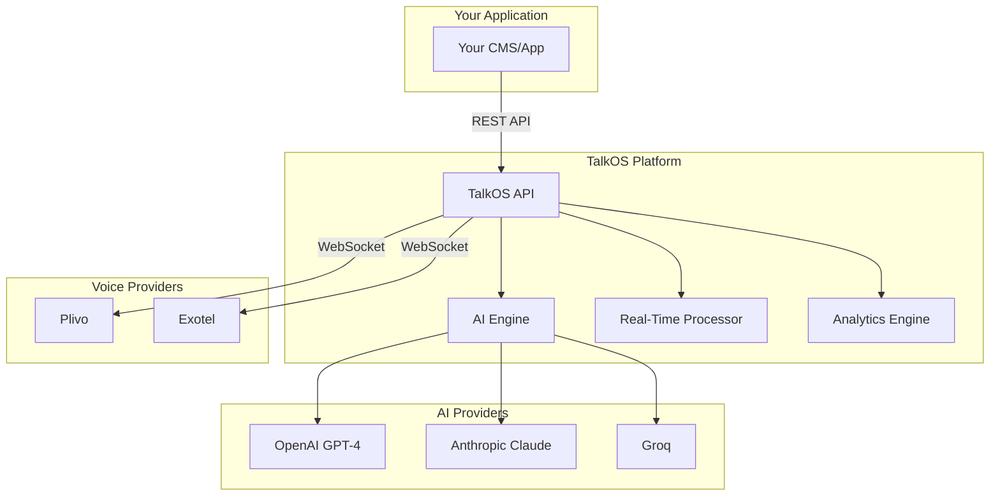

## What is TalkOS?

TalkOS is a **multi-tenant AI Voice Calling API** that enables businesses to integrate intelligent voice calling capabilities into their applications. Built for scale, TalkOS handles everything from outbound campaigns to inbound IVR, real-time transcription, sentiment analysis, and more.

<CardGroup cols={2}>
  <Card
    title="Quick Start"
    icon="rocket"
    href="/quickstart"
  >
    Make your first AI voice call in under 5 minutes
  </Card>
  <Card
    title="API Reference"
    icon="code"
    href="/api-reference/introduction"
  >
    Complete API documentation with live playground
  </Card>
  <Card
    title="Plivo Setup"
    icon="phone"
    href="/guides/plivo-setup"
  >
    Configure Plivo as your voice provider
  </Card>
  <Card
    title="Exotel Setup"
    icon="phone-volume"
    href="/guides/exotel-setup"
  >
    Configure Exotel for India-based calling
  </Card>
</CardGroup>

## Key Features

<AccordionGroup>
  <Accordion title="🤖 AI-Powered Conversations" icon="robot">
    - **GPT-4/Claude Integration**: Natural language understanding and responses
    - **Custom Prompts**: Define AI behavior per call or per tenant
    - **Tool Calling**: Let AI execute functions during calls (book appointments, check balances, etc.)
    - **Knowledge Base RAG**: AI answers questions from your uploaded documents
  </Accordion>
  
  <Accordion title="📞 Multi-Provider Support" icon="phone">
    - **Plivo**: Global voice coverage with competitive rates
    - **Exotel**: India-focused provider with local number support
    - **Automatic Failover**: Switch providers if one fails
    - **Unified API**: Same API regardless of which provider you use
  </Accordion>
  
  <Accordion title="🏢 Multi-Tenant Architecture" icon="building">
    - **Tenant Isolation**: Each tenant's data is completely isolated
    - **Per-Tenant API Keys**: Unique authentication per customer
    - **Tenant-Scoped Numbers**: Phone numbers belong to specific tenants
    - **Usage Tracking**: Per-tenant billing and analytics
  </Accordion>
  
  <Accordion title="📊 Real-Time Analytics" icon="chart-line">
    - **Live Dashboard**: Monitor active calls in real-time
    - **Sentiment Analysis**: Track customer sentiment during calls
    - **Call Quality Metrics**: Latency, audio quality, interruptions
    - **Cost Analytics**: Per-call and per-tenant cost tracking
  </Accordion>
  
  <Accordion title="🔒 Enterprise Security" icon="shield">
    - **PII Detection & Redaction**: Automatically detect and mask sensitive data
    - **GDPR Compliance**: Built-in data access and erasure APIs
    - **Voice Biometrics**: Verify caller identity via voiceprint
    - **Call Masking**: Hide real phone numbers from agents
  </Accordion>
</AccordionGroup>

## Architecture Overview



## Who Uses TalkOS?

| Industry | Use Case |
|----------|----------|
| **Customer Support** | AI-powered first-line support, human escalation when needed |
| **Sales & Marketing** | Automated outbound campaigns, lead qualification |
| **Healthcare** | Appointment reminders, patient follow-ups, prescription refills |
| **Finance** | Account balance inquiries, fraud alerts, payment reminders |
| **E-Commerce** | Order status, delivery updates, return processing |
| **Real Estate** | Property inquiries, viewing scheduling, tenant communications |

## Pricing

TalkOS offers usage-based pricing with no minimum commitment.

| Component | Price |
|-----------|-------|
| API Calls | $0.001 per API call |
| Voice Minutes | $0.02 - $0.05 per minute (varies by country) |
| AI Processing | $0.01 per minute of AI conversation |
| Transcription | $0.006 per minute |
| Knowledge Base | $0.01 per 1,000 tokens |

<Note>
Contact [sales@talkos.io](mailto:sales@talkos.io) for enterprise pricing with volume discounts.
</Note>

## Getting Started

<Steps>
  <Step title="Create a Tenant">
    Register your organization to get API credentials
    ```bash
    curl -X POST https://api.talkos.io/api/tenants/create \
      -H "Content-Type: application/json" \
      -d '{"name": "Your Company", "email": "admin@yourcompany.com"}'
    ```
  </Step>
  <Step title="Configure Voice Provider">
    Set up Plivo or Exotel credentials in your tenant settings
  </Step>
  <Step title="Make Your First Call">
    Start an AI-powered voice call
    ```bash
    curl -X POST https://api.talkos.io/api/calls/start \
      -H "x-api-key: YOUR_API_KEY" \
      -H "x-tenant-id: YOUR_TENANT_ID" \
      -H "Content-Type: application/json" \
      -d '{
        "to": "+919876543210",
        "from": "+911234567890",
        "prompt": "You are a friendly sales assistant..."
      }'
    ```
  </Step>
</Steps>

## Support

<CardGroup cols={3}>
  <Card title="Documentation" icon="book" href="/api-reference/introduction">
    Comprehensive API docs
  </Card>
  <Card title="Email Support" icon="envelope" href="mailto:support@talkos.io">
    support@talkos.io
  </Card>
  <Card title="Status Page" icon="signal" href="https://status.talkos.io">
    System status & uptime
  </Card>
</CardGroup>
