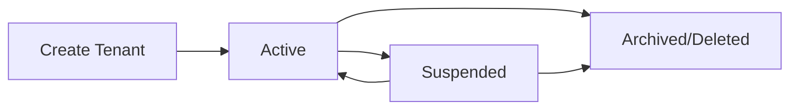
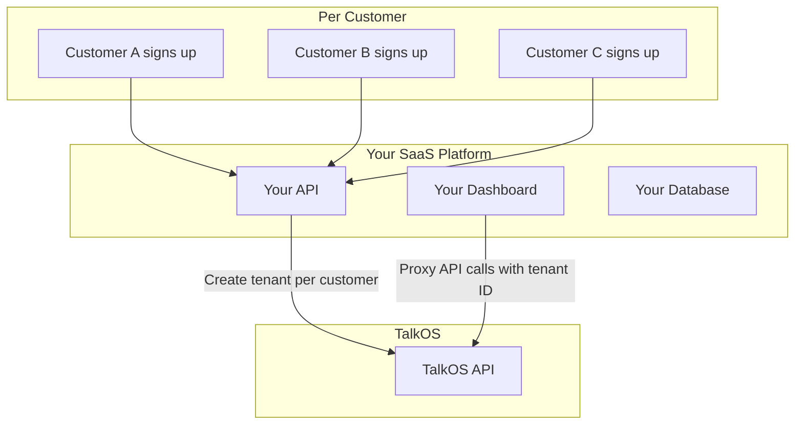

## Overview

TalkOS is designed from the ground up as a **multi-tenant platform**. Every API call, database query, and analytics event is scoped to a specific tenant. This means you can serve hundreds of customers from a single TalkOS deployment, where each customer's data is completely isolated.

---

## How Tenancy Works

Every API request **must** include a tenant identifier:

```bash
curl -X POST https://api.talkos.io/api/calls/start \
  -H "x-api-key: sk_acme_abc123..." \
  -H "X-Tenant-ID: acme-corp" \     # ← Required on every request
  -H "Content-Type: application/json" \
  -d '{"to": "+15551234567", "prompt": "..."}'
```

The `X-Tenant-ID` header can also be passed as:
- Query parameter: `?tenantId=acme-corp`
- Request body field: `"tenantId": "acme-corp"`

---

## Tenant Lifecycle



### Create a Tenant

```bash
curl -X POST https://api.talkos.io/api/tenants/create \
  -H "Content-Type: application/json" \
  -d '{
    "name": "Acme Corp",
    "email": "admin@acme.com",
    "description": "Enterprise customer",
    "plan": "pro"
  }'
```

Response:
```json
{
  "success": true,
  "tenant": {
    "tenantId": "acme-corp-a1b2c3",
    "name": "Acme Corp",
    "apiKey": "sk_acme_abc123def456...",
    "status": "active",
    "plan": "pro",
    "createdAt": "2026-02-18T10:00:00Z"
  }
}
```

### Manage Tenant State

| Action | Endpoint | Effect |
|--------|----------|--------|
| **Suspend** | `POST /api/tenants/:id/suspend` | Blocks all API calls. Data preserved. |
| **Activate** | `POST /api/tenants/:id/activate` | Re-enables API access |
| **Delete** | `DELETE /api/tenants/:id` | Archives tenant (soft delete) |
| **Rotate Key** | `POST /api/tenants/:id/rotate-key` | Issues new API key, invalidates old one |

---

## Isolation Guarantees

| Resource | Isolation Method |
|----------|-----------------|
| **Database Records** | All MongoDB queries filtered by `tenantId` |
| **API Keys** | Unique per tenant, validated on every request |
| **Phone Numbers** | Assigned to specific tenants |
| **Knowledge Bases** | Scoped to tenant |
| **Transcripts** | Only accessible by owning tenant |
| **Analytics** | Computed per-tenant |
| **Audit Logs** | Tenant-scoped audit trail |
| **Configuration** | Per-tenant config overrides |

---

## Usage & Billing

Track per-tenant usage for billing:

```bash
curl https://api.talkos.io/api/tenants/acme-corp/usage \
  -H "x-api-key: YOUR_ADMIN_KEY" \
  -H "X-Tenant-ID: acme-corp"
```

Returns:
```json
{
  "success": true,
  "usage": {
    "totalCalls": 1523,
    "totalMinutes": 4567.5,
    "totalWebSessions": 342,
    "apiRequests": 45230,
    "storageUsedMB": 128.5,
    "period": "2026-02"
  }
}
```

---

## Plans & Features

Tenants can have different plans with different feature access:

| Feature | Free | Pro | Enterprise |
|---------|:----:|:---:|:----------:|
| Outbound Calls | 100/mo | 10,000/mo | Unlimited |
| Inbound Calls | — | 5,000/mo | Unlimited |
| Web Sessions | 50/mo | 5,000/mo | Unlimited |
| Knowledge Bases | 1 | 10 | Unlimited |
| Voice Cloning | — | 5 voices | Unlimited |
| Voice Biometrics | — | — | Yes |
| Coaching | — | Yes | Yes |
| Compliance Suite | — | — | Yes |
| Custom SLA | — | — | Yes |

---

## Building a SaaS on TalkOS

If you're building a SaaS product, here's the recommended pattern:



**Steps:**
1. When a customer signs up on your platform, call `POST /api/tenants/create`
2. Store the returned `tenantId` and `apiKey` in your database
3. When making API calls on behalf of a customer, use their `tenantId`
4. Use `/api/tenants/:id/usage` for billing calculations

---

## Security Best Practices

<Warning>
**Never expose tenant API keys to frontend code.** Always proxy TalkOS API calls through your backend.
</Warning>

<Tip>
**Rotate API keys regularly.** Use `POST /api/tenants/:id/rotate-key` to issue new keys without downtime.
</Tip>

- Store API keys encrypted in your database
- Use HTTPS for all API calls
- Implement IP allowlisting at the application level
- Monitor usage per tenant for anomaly detection
- Set up webhook validation to prevent spoofed callbacks
