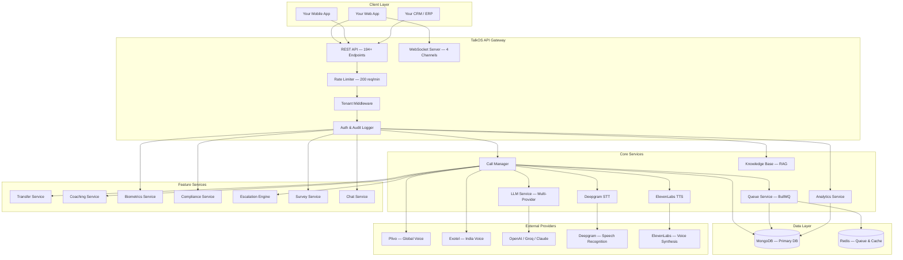
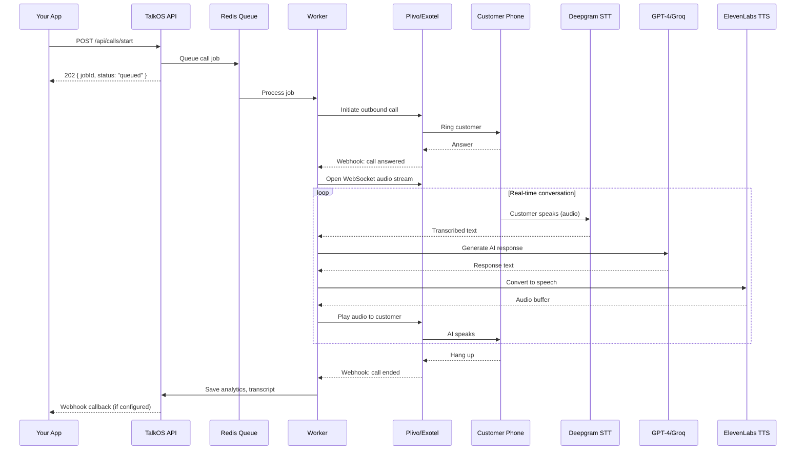
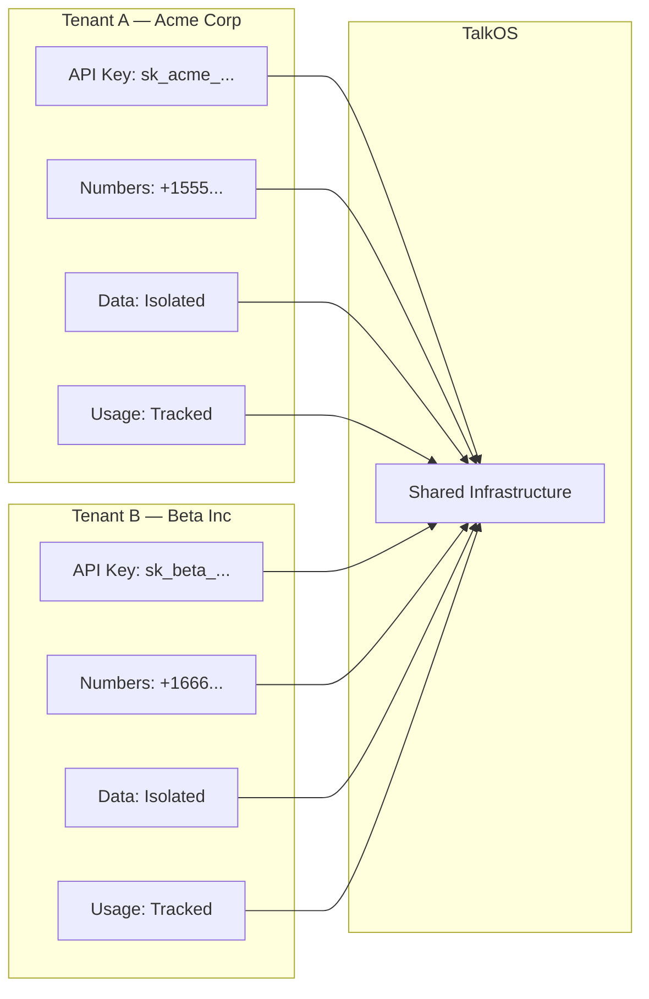

## What is TalkOS?

TalkOS is an **AI Voice Calling Platform** that provides a complete backend for building voice-powered applications. It combines telephony providers (Plivo, Exotel), speech-to-text (Deepgram), large language models (GPT-4, Claude, Groq), and text-to-speech (ElevenLabs) into a single, unified REST API.

Instead of integrating 5+ services, you call **one API** and TalkOS orchestrates everything.

---

## System Architecture



---

## How a Call Works

Here's the complete lifecycle of an outbound AI call:



---

## Core Components

### 1. API Gateway

The REST API is the primary interface. Every request passes through:

| Layer | Purpose |
|-------|---------|
| **CORS** | Allow cross-origin requests |
| **Rate Limiter** | 200 req/min per IP globally, 100/min for call endpoints |
| **API Key Auth** | Validates `x-api-key` header against tenant database |
| **Tenant Middleware** | Extracts `X-Tenant-ID`, validates tenant is active |
| **Audit Logger** | Logs every request to MongoDB (fire-and-forget) |

### 2. Call Manager

The orchestrator that manages the entire call lifecycle:

- **Queue Management**: Calls go through BullMQ (Redis) for reliable processing
- **Concurrency Control**: Configurable per-worker concurrency (default: 5)
- **Rate Limiting**: Max 10 calls per 60 seconds per worker
- **Retry Logic**: Failed calls retry up to 2 times with exponential backoff

### 3. AI Engine

Multi-provider LLM with automatic failover:

| Provider | Model | Use Case |
|----------|-------|----------|
| **Groq** | Llama 3.1 70B | Default — fastest inference (< 200ms) |
| **OpenAI** | GPT-4o | Fallback — best reasoning |
| **Anthropic** | Claude 3.5 | Alternative — best instruction following |

**Failover**: Groq → OpenAI → Claude (automatic, transparent to caller)

### 4. Voice Pipeline

Real-time audio processing:

| Component | Provider | Latency |
|-----------|----------|---------|
| **Speech-to-Text** | Deepgram Nova-2 | ~150ms |
| **Text-to-Speech** | ElevenLabs Flash v2.5 | ~200ms |
| **Total Round-Trip** | — | ~500-800ms |

### 5. WebSocket Channels

Four dedicated WebSocket endpoints for real-time communication:

| Channel | Path | Purpose |
|---------|------|---------|
| **Audio Stream** | `/audio-stream` | Bidirectional call audio (Plivo/Exotel) |
| **Web Session** | `/web-session` | Browser-based AI voice sessions |
| **Agent Dashboard** | `/agent-dashboard` | Agent real-time updates |
| **Supervisor Dashboard** | `/supervisor-dashboard` | Supervisor operational view |

---

## Multi-Tenant Architecture

TalkOS is built for SaaS platforms that need to serve multiple customers:



**Isolation guarantees:**
- Each tenant's API key is unique and can be rotated
- All database queries are scoped to `tenantId`
- Phone numbers are assigned to specific tenants
- Analytics and transcripts are tenant-isolated
- Usage tracking is per-tenant for billing

---

## Data Flow

### Outbound Call Flow

1. **API Request** → Your app sends `POST /api/calls/start`
2. **Queue** → Job added to Redis BullMQ queue
3. **Worker** → Worker picks up job, initiates call via Plivo/Exotel
4. **Answer** → When customer answers, audio WebSocket opens
5. **Conversation** → Real-time STT → LLM → TTS loop
6. **Hangup** → Call ends, analytics saved to MongoDB
7. **Webhook** → Your app receives callback with call results

### Inbound Call Flow

1. **Incoming Call** → Customer calls your purchased number
2. **Webhook** → Plivo/Exotel sends webhook to TalkOS
3. **Tenant Lookup** → TalkOS identifies the tenant for that number
4. **AI Agent** → AI picks up with tenant-configured prompt/greeting
5. **Conversation** → Same real-time STT → LLM → TTS loop
6. **Analytics** → Call metrics, transcript, sentiment saved

---

## Technology Stack

| Component | Technology | Why |
|-----------|-----------|-----|
| **Runtime** | Node.js 20+ (ESM) | Event-driven, async I/O for real-time |
| **Framework** | Express.js | Battle-tested, middleware ecosystem |
| **Database** | MongoDB (Atlas) | Flexible schema, horizontal scaling |
| **Cache/Queue** | Redis + BullMQ | Reliable job queues, pub/sub |
| **Process Manager** | PM2 | Multi-core clustering, zero-downtime reload |
| **WebSocket** | ws (native) | Low overhead, high performance |
| **Logging** | Custom structured logger | JSON logs, log levels, file rotation |

---

## Deployment Options

### Single Instance
```bash
node src/server.js
```
Good for development and testing.

### PM2 Cluster Mode
```bash
pm2 start ecosystem.config.cjs
```
Recommended for production. Automatically uses all CPU cores.

### Docker
```dockerfile
FROM node:20-alpine
WORKDIR /app
COPY package*.json ./
RUN npm ci --production
COPY . .
EXPOSE 3000
CMD ["node", "src/server.js"]
```

### Scaling Guidelines

| Concurrent Calls | Recommended Setup |
|:-----------------:|-------------------|
| 1–50 | Single instance, 1 core |
| 50–200 | PM2 cluster, 4 cores |
| 200–1,000 | PM2 cluster, 8 cores + Redis |
| 1,000+ | Kubernetes, horizontal pod autoscaling |

---

## What's Next?

<CardGroup cols={2}>
  <Card title="Quick Start" icon="rocket" href="/quickstart">
    Make your first call in 5 minutes
  </Card>
  <Card title="Feature Guides" icon="book-open" href="/features/ai-conversations">
    Explore every capability in detail
  </Card>
</CardGroup>
