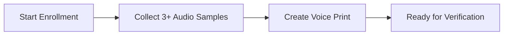

## Overview

TalkOS takes security seriously. The platform includes enterprise-grade security features built-in, not bolted on. Every API call is authenticated, every action is logged, and sensitive data is protected.

---

## Authentication

### API Key Authentication

Every tenant gets a unique API key. Include it in every request:

```bash
curl https://api.talkos.io/api/calls/start \
  -H "x-api-key: sk_your_api_key_here" \
  -H "X-Tenant-ID: your-tenant-id"
```

**Key features:**
- Keys are scoped to a single tenant
- Rotate keys without downtime via `POST /api/tenants/:id/rotate-key`
- Old keys are immediately invalidated on rotation
- Keys are stored hashed in the database

### Admin JWT Authentication

Admin dashboard uses JWT tokens:

```bash
# Login
curl -X POST https://api.talkos.io/admin/auth/login \
  -d '{"username": "admin", "password": "SecurePass123!"}'

# Use token
curl https://api.talkos.io/admin/api/system \
  -H "Authorization: Bearer eyJhbGciOi..."
```

---

## PII Detection & Redaction

Automatically detect and mask **15+ types** of personally identifiable information:

| PII Type | Example | Redacted |
|----------|---------|----------|
| SSN | 123-45-6789 | `[SSN_REDACTED]` |
| Credit Card | 4111-1111-1111-1111 | `[CARD_REDACTED]` |
| Email | john@example.com | `[EMAIL_REDACTED]` |
| Phone | +15551234567 | `[PHONE_REDACTED]` |
| Address | 123 Main St, NYC | `[ADDRESS_REDACTED]` |
| Date of Birth | 01/15/1990 | `[DOB_REDACTED]` |
| IP Address | 192.168.1.1 | `[IP_REDACTED]` |

### Detect PII

```bash
curl -X POST https://api.talkos.io/api/compliance/pii/detect \
  -H "x-api-key: YOUR_KEY" \
  -H "X-Tenant-ID: YOUR_TENANT" \
  -d '{"text": "My SSN is 123-45-6789 and email is john@example.com"}'
```

### Redact PII

```bash
curl -X POST https://api.talkos.io/api/compliance/pii/redact \
  -H "x-api-key: YOUR_KEY" \
  -H "X-Tenant-ID: YOUR_TENANT" \
  -d '{"text": "My SSN is 123-45-6789 and email is john@example.com"}'
```

---

## GDPR Compliance

Built-in GDPR support with two key operations:

### Subject Access Request (SAR)

Retrieve all data associated with a customer identifier:

```bash
curl -X POST https://api.talkos.io/api/compliance/gdpr/access \
  -d '{"identifier": "+15551234567", "actorId": "admin-001"}'
```

Returns all call records, transcripts, analytics, and voice prints for that identifier.

### Right to Erasure

Delete all data for a customer:

```bash
curl -X POST https://api.talkos.io/api/compliance/gdpr/erasure \
  -d '{
    "identifier": "+15551234567",
    "reason": "Customer requested data deletion",
    "actorId": "admin-001"
  }'
```

Permanently removes:
- Call records & transcripts
- Voice biometric prints
- Analytics data
- Survey responses
- Chat messages
- Knowledge base queries

---

## Consent Management

Track and record customer consent for recording, data processing, etc.:

```bash
curl -X POST https://api.talkos.io/api/compliance/consent \
  -d '{
    "callUuid": "call-uuid-123",
    "consentType": "recording",
    "granted": true,
    "phoneNumber": "+15551234567",
    "method": "verbal"
  }'
```

**Consent types:** `recording`, `data_processing`, `marketing`, `analytics`
**Methods:** `verbal`, `written`, `electronic`, `implied`

---

## Voice Biometrics

Verify caller identity using voiceprint matching:

### Enrollment Flow



```bash
# Step 1: Start enrollment
curl -X POST https://api.talkos.io/api/voice-biometrics/enroll \
  -d '{"callerId": "+15551234567", "consentGiven": true}'

# Step 2: Add audio samples (3+ recommended)
curl -X POST https://api.talkos.io/api/voice-biometrics/enroll/sample \
  -d '{"callerId": "+15551234567", "audioBase64": "base64_audio_data"}'

# Step 3: Verify caller
curl -X POST https://api.talkos.io/api/voice-biometrics/verify \
  -d '{"callerId": "+15551234567", "audioBase64": "base64_audio_data"}'
```

### GDPR-Compliant Deletion

```bash
curl -X DELETE https://api.talkos.io/api/voice-biometrics/+15551234567
```

---

## Call Masking

Hide real phone numbers from agents. Useful for privacy-sensitive industries:

```bash
# Configure masking
curl -X POST https://api.talkos.io/api/features/masking/configure \
  -d '{"enabled": true, "maskPattern": "XXX-XXX-{last4}", "allowUnmask": true}'

# Mask a number
curl -X POST https://api.talkos.io/api/features/masking/mask \
  -d '{"phoneNumber": "+15551234567"}'
# → Returns: "XXX-XXX-4567"
```

**Unmask flow:** Agent requests → Supervisor approves → Full number revealed. All actions are audit-logged.

---

## Audit Trail

Every significant action is logged to the audit trail:

```bash
curl https://api.talkos.io/api/compliance/audit?limit=20
```

Sample audit entry:
```json
{
  "timestamp": "2026-02-18T10:30:00Z",
  "action": "gdpr_erasure",
  "actor": "admin-001",
  "identifier": "+15551234567",
  "details": {
    "recordsDeleted": 47,
    "reason": "Customer requested data deletion"
  },
  "tenantId": "acme-corp"
}
```

**Logged actions include:**
- API key rotations
- Tenant state changes
- GDPR access/erasure requests
- Consent recordings
- PII detections
- Unmask requests/approvals
- Call masking operations

---

## Data Retention

Automatically enforce data retention policies:

```bash
curl -X POST https://api.talkos.io/api/compliance/retention/enforce
```

Deletes records older than the configured retention period (e.g., 90 days for transcripts, 365 days for analytics).

---

## Rate Limiting

| Scope | Limit |
|-------|-------|
| Global API | 200 requests/min per IP |
| Call Start | 100 requests/min |
| Queue Processing | 10 calls/60s per worker |
| Admin API | 50 requests/min |

Exceeding limits returns `429 Too Many Requests`.

---

## Best Practices

<Tip>
1. **Rotate API keys** every 90 days
2. **Never expose keys** in frontend code
3. **Enable PII redaction** before storing transcripts
4. **Record consent** at the start of every call
5. **Monitor audit logs** for suspicious activity
6. **Use voice biometrics** for high-security flows (banking, healthcare)
7. **Set retention policies** appropriate for your industry
</Tip>
