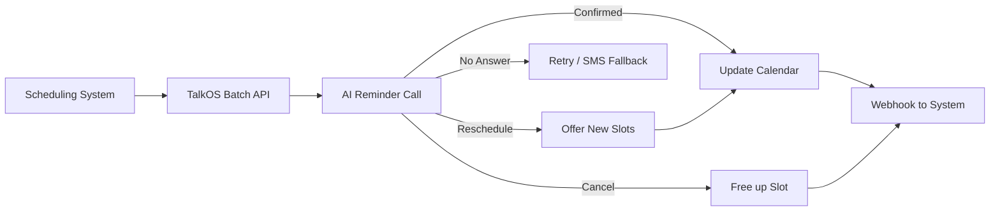

## Overview

Reduce no-shows by 40-60% with automated AI appointment reminder calls. Patients/customers can confirm, cancel, or reschedule right on the call.

---

## Architecture



---

## Step 1: Configure Reminder Agent

```bash
curl -X PUT https://api.talkos.io/api/config \
  -d '{
    "voice": { "voiceId": "rachel", "speed": 0.95 },
    "llm": { "provider": "groq", "temperature": 0.5 }
  }'
```

## Step 2: Send Reminder Calls

### Single Reminder

```bash
curl -X POST https://api.talkos.io/api/calls/initiate \
  -H "x-api-key: YOUR_KEY" \
  -H "X-Tenant-ID: YOUR_TENANT" \
  -d '{
    "to": "+14155551234",
    "systemPrompt": "You are calling from Dr. Smith'\''s office to remind about an appointment. Details: Patient: Jane Doe, Date: February 20th at 2:30 PM, Doctor: Dr. Smith, Location: 456 Medical Center. Ask them to confirm, cancel, or reschedule. If rescheduling, offer available slots: Feb 21 at 10am, Feb 22 at 3pm, Feb 23 at 11am.",
    "metadata": {
      "appointmentId": "appt-001",
      "patientId": "patient-001",
      "type": "reminder"
    },
    "maxDuration": 120,
    "tools": [
      {
        "type": "function",
        "function": {
          "name": "confirm_appointment",
          "description": "Confirm the appointment",
          "parameters": { "type": "object", "properties": { "confirmed": { "type": "boolean" } } }
        }
      },
      {
        "type": "function",
        "function": {
          "name": "reschedule_appointment",
          "description": "Reschedule to a new date/time",
          "parameters": { "type": "object", "properties": { "newDateTime": { "type": "string" } } }
        }
      },
      {
        "type": "function",
        "function": {
          "name": "cancel_appointment",
          "description": "Cancel the appointment",
          "parameters": { "type": "object", "properties": { "reason": { "type": "string" } } }
        }
      }
    ]
  }'
```

### Batch Reminders (100+ Calls)

```bash
curl -X POST https://api.talkos.io/api/calls/batch \
  -d '{
    "calls": [
      {
        "to": "+14155551001",
        "systemPrompt": "Reminder for Jane Doe, Feb 20 at 2:30 PM, Dr. Smith...",
        "metadata": { "appointmentId": "appt-001" }
      },
      {
        "to": "+14155551002",
        "systemPrompt": "Reminder for Bob Jones, Feb 20 at 3:00 PM, Dr. Patel...",
        "metadata": { "appointmentId": "appt-002" }
      }
    ],
    "concurrency": 10,
    "retryPolicy": {
      "maxRetries": 2,
      "retryOn": ["no_answer"],
      "retryDelay": 7200
    }
  }'
```

## Step 3: Handle Outcomes via Webhooks

```bash
curl -X POST https://api.talkos.io/api/webhooks/configure \
  -d '{
    "url": "https://your-ehr.com/talkos-webhook",
    "events": ["call.ended"]
  }'
```

**Process webhook in your system:**
```javascript
app.post('/talkos-webhook', (req, res) => {
  const { event, callUuid, metadata, toolCalls } = req.body;
  
  for (const tool of toolCalls) {
    switch (tool.name) {
      case 'confirm_appointment':
        markConfirmed(metadata.appointmentId);
        break;
      case 'reschedule_appointment':
        reschedule(metadata.appointmentId, tool.args.newDateTime);
        break;
      case 'cancel_appointment':
        cancelAppt(metadata.appointmentId, tool.args.reason);
        openSlot(metadata.appointmentId);
        break;
    }
  }
  res.sendStatus(200);
});
```

## Step 4: HIPAA Compliance

```bash
# Enable PII auto-redaction for medical records
curl -X POST https://api.talkos.io/api/features/compliance/pii/auto-redact \
  -d '{ "enabled": true, "types": ["SSN", "MEDICAL_ID", "DOB"] }'

# Set short retention
curl -X POST https://api.talkos.io/api/features/compliance/retention \
  -d '{ "transcripts": { "retainDays": 30 }, "callRecords": { "retainDays": 90 } }'
```

---

## Scheduling Patterns

| Pattern | Timing | API Method |
|---------|--------|------------|
| 48-hour reminder | 2 days before | Batch call |
| Same-day reminder | Morning of | Single call |
| Follow-up on no-answer | 4 hours after first attempt | Auto-retry |
| Post-visit survey | 1 hour after appointment time | Survey API |

---

## KPIs to Track

| KPI | Target | Measurement |
|-----|--------|-------------|
| Confirmation Rate | > 70% | Confirmed / total calls |
| No-Show Reduction | > 40% | Compare to baseline |
| Reschedule Rate | 10-15% | Rescheduled / total |
| Answer Rate | > 60% | Answered / attempted |
| Call Duration | < 60s | Average handle time |
