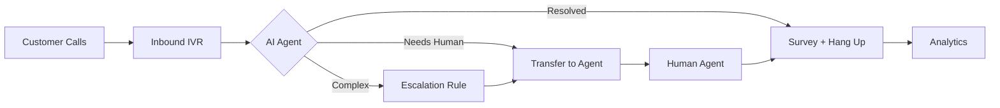

## Overview

Deploy 24/7 AI customer support that handles queries, resolves issues, and escalates to humans when needed. This playbook walks through the complete setup from first call to production.

---

## Architecture



---

## Step 1: Set Up Inbound Number

Register your support number for AI handling:

```bash
# Register inbound number
curl -X POST https://api.talkos.io/api/inbound/numbers/register \
  -H "x-api-key: YOUR_KEY" \
  -H "X-Tenant-ID: YOUR_TENANT" \
  -d '{
    "phoneNumber": "+18001234567",
    "provider": "plivo",
    "label": "Main Support Line"
  }'

# Configure AI behavior
curl -X PUT https://api.talkos.io/api/inbound/numbers/+18001234567/config \
  -d '{
    "aiEnabled": true,
    "greeting": "Hello! Thank you for calling Acme Corp. How can I help you today?",
    "systemPrompt": "You are Acme Corp customer support. Be friendly, concise, and helpful. You can check order status, process returns, answer product questions, and schedule callbacks. If you cannot resolve an issue after 3 attempts, transfer to a human agent.",
    "language": "en",
    "voiceId": "rachel",
    "maxDuration": 600,
    "tools": [
      {
        "type": "function",
        "function": {
          "name": "check_order_status",
          "description": "Look up an order by order number or customer email",
          "parameters": {
            "type": "object",
            "properties": {
              "orderId": { "type": "string" },
              "email": { "type": "string" }
            }
          }
        }
      },
      {
        "type": "function",
        "function": {
          "name": "initiate_return",
          "description": "Start a return process for an order",
          "parameters": {
            "type": "object",
            "properties": {
              "orderId": { "type": "string" },
              "reason": { "type": "string" }
            }
          }
        }
      },
      {
        "type": "function",
        "function": {
          "name": "transfer_to_agent",
          "description": "Transfer to a human agent",
          "parameters": {
            "type": "object",
            "properties": {
              "reason": { "type": "string" },
              "department": { "type": "string", "enum": ["billing", "technical", "returns"] }
            }
          }
        }
      }
    ]
  }'
```

## Step 2: Add Knowledge Base

Upload FAQ and product docs so the AI can answer questions:

```bash
curl -X POST https://api.talkos.io/api/knowledge-base \
  -H "x-api-key: YOUR_KEY" \
  -H "X-Tenant-ID: YOUR_TENANT" \
  -d '{
    "name": "Support Knowledge Base",
    "content": "## Return Policy\nCustomers can return items within 30 days...\n\n## Shipping\nStandard shipping: 5-7 business days...\n\n## Products\n...",
    "type": "faq"
  }'
```

## Step 3: Register Support Agents

```bash
# Add billing agent
curl -X POST https://api.talkos.io/api/transfer/agents \
  -d '{
    "agentId": "billing-sarah",
    "name": "Sarah Johnson",
    "phoneNumber": "+14155551001",
    "skills": ["billing", "returns"],
    "maxConcurrentCalls": 3
  }'

# Add technical agent
curl -X POST https://api.talkos.io/api/transfer/agents \
  -d '{
    "agentId": "tech-mike",
    "name": "Mike Chen",
    "phoneNumber": "+14155551002",
    "skills": ["technical"],
    "maxConcurrentCalls": 2
  }'
```

## Step 4: Set Escalation Rules

```bash
# Escalate frustrated customers
curl -X POST https://api.talkos.io/api/features/escalation/rules \
  -d '{
    "name": "Frustrated Customer",
    "conditions": { "sentimentBelow": -0.6, "turnCountAbove": 8 },
    "action": { "type": "transfer_to_agent", "targetSkill": "retention", "priority": "high" },
    "enabled": true
  }'

# Escalate keyword mentions
curl -X POST https://api.talkos.io/api/features/escalation/rules \
  -d '{
    "name": "Legal Mention",
    "conditions": { "keywordDetected": ["lawyer", "legal", "sue", "attorney"] },
    "action": { "type": "transfer_to_agent", "targetSkill": "supervisor", "priority": "urgent" },
    "enabled": true
  }'
```

## Step 5: Configure Post-Call Survey

```bash
curl -X POST https://api.talkos.io/api/features/survey/templates \
  -d '{
    "name": "Support CSAT",
    "questions": [
      { "id": "q1", "type": "rating", "text": "Rate your experience (1-5)", "scale": { "min": 1, "max": 5 } },
      { "id": "q2", "type": "yes_no", "text": "Was your issue resolved?" }
    ],
    "isDefault": true
  }'

# Enable auto-survey after every call
curl -X POST https://api.talkos.io/api/features/survey/auto-config \
  -d '{ "enabled": true, "triggerOn": "call_end" }'
```

## Step 6: Set Up Webhooks

Receive real-time notifications:

```bash
curl -X POST https://api.talkos.io/api/webhooks/configure \
  -d '{
    "url": "https://your-backend.com/talkos-webhook",
    "events": ["call.started", "call.ended", "call.transferred", "survey.completed"],
    "secret": "webhook-signing-secret"
  }'
```

## Step 7: Monitor & Optimize

```bash
# Real-time dashboard
curl https://api.talkos.io/api/analytics/realtime

# Daily KPIs
curl "https://api.talkos.io/api/analytics/calls?groupBy=day"

# Sentiment trends
curl "https://api.talkos.io/api/analytics/sentiment?dateFrom=2026-01-01"

# Survey results
curl https://api.talkos.io/api/features/survey/analytics/summary

# Tag distribution (common issues)
curl https://api.talkos.io/api/features/tags/analytics
```

---

## KPIs to Track

| KPI | Target | API Source |
|-----|--------|-----------|
| AI Resolution Rate | > 70% | Survey `q2` + analytics |
| Average Handle Time | < 120s | Call analytics |
| CSAT Score | > 4.0/5.0 | Survey analytics |
| Transfer Rate | < 30% | Transfer analytics |
| First Contact Resolution | > 80% | Call + tag analytics |
| Customer Sentiment | > 0.3 | Sentiment analytics |
