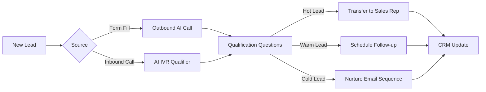

## Overview

Qualify inbound and outbound leads instantly with AI voice agents. Ask qualification questions, score leads in real-time, and route hot leads to sales reps — 24/7.

---

## Architecture



---

## Step 1: Configure Qualification Agent

```bash
curl -X PUT https://api.talkos.io/api/config \
  -d '{
    "llm": { "provider": "groq", "model": "llama-3.3-70b-versatile", "temperature": 0.7 },
    "voice": { "voiceId": "josh", "speed": 1.0 }
  }'
```

## Step 2: Create Qualification Script

### Outbound Qualifier

```bash
curl -X POST https://api.talkos.io/api/calls/initiate \
  -H "x-api-key: YOUR_KEY" \
  -H "X-Tenant-ID: YOUR_TENANT" \
  -d '{
    "to": "+14155551234",
    "systemPrompt": "You are Alex from TalkOS. You are calling to follow up on their demo request. Be conversational and professional. Ask these BANT qualification questions naturally: 1) Budget: What is their budget for this solution? 2) Authority: Are they the decision maker? 3) Need: What specific problem are they trying to solve? 4) Timeline: When do they want to implement? Based on their answers, use the qualify_lead tool to submit scores. If they score high (budget > $500/mo, decision maker, timeline < 3 months), offer to transfer to a sales specialist immediately.",
    "metadata": {
      "leadId": "lead-001",
      "source": "website_form",
      "company": "Acme Corp"
    },
    "tools": [
      {
        "type": "function",
        "function": {
          "name": "qualify_lead",
          "description": "Submit lead qualification scores",
          "parameters": {
            "type": "object",
            "properties": {
              "budget": { "type": "string", "enum": ["under_100", "100_500", "500_1000", "over_1000"] },
              "authority": { "type": "string", "enum": ["decision_maker", "influencer", "end_user"] },
              "need": { "type": "string" },
              "timeline": { "type": "string", "enum": ["immediate", "1_3_months", "3_6_months", "exploring"] },
              "overallScore": { "type": "string", "enum": ["hot", "warm", "cold"] }
            }
          }
        }
      },
      {
        "type": "function",
        "function": {
          "name": "transfer_to_sales",
          "description": "Transfer hot lead to sales rep",
          "parameters": {
            "type": "object",
            "properties": {
              "reason": { "type": "string" },
              "qualificationSummary": { "type": "string" }
            }
          }
        }
      },
      {
        "type": "function",
        "function": {
          "name": "schedule_followup",
          "description": "Schedule a follow-up call",
          "parameters": {
            "type": "object",
            "properties": {
              "preferredDate": { "type": "string" },
              "notes": { "type": "string" }
            }
          }
        }
      }
    ]
  }'
```

### Inbound Qualifier (IVR)

```bash
curl -X PUT https://api.talkos.io/api/inbound/numbers/+18005551234/config \
  -d '{
    "aiEnabled": true,
    "greeting": "Hi, thanks for calling TalkOS! I'\''d love to learn about your needs so I can connect you with the right team member.",
    "systemPrompt": "You are a friendly AI qualifier. Ask about their: 1) Company size, 2) Current solution, 3) Budget range, 4) Timeline. Score them and route accordingly.",
    "tools": [...]
  }'
```

## Step 3: Route by Score

### Register Sales Reps

```bash
curl -X POST https://api.talkos.io/api/transfer/agents \
  -d '{
    "agentId": "sales-rep-001",
    "name": "Emily Torres",
    "phoneNumber": "+14155551001",
    "skills": ["enterprise", "mid-market"],
    "maxConcurrentCalls": 2
  }'
```

### Set Auto-Transfer Rules

```bash
# Hot leads → immediate transfer
curl -X POST https://api.talkos.io/api/features/escalation/rules \
  -d '{
    "name": "Hot Lead Transfer",
    "conditions": { "keywordDetected": ["hot_lead_qualified"] },
    "action": { "type": "transfer_to_agent", "targetSkill": "enterprise" }
  }'
```

## Step 4: Batch Qualification Campaigns

Scale to hundreds of leads:

```bash
curl -X POST https://api.talkos.io/api/calls/batch \
  -d '{
    "calls": [
      { "to": "+14155551001", "systemPrompt": "...", "metadata": { "leadId": "L001" } },
      { "to": "+14155551002", "systemPrompt": "...", "metadata": { "leadId": "L002" } },
      { "to": "+14155551003", "systemPrompt": "...", "metadata": { "leadId": "L003" } }
    ],
    "concurrency": 5,
    "retryPolicy": { "maxRetries": 2, "retryOn": ["no_answer"], "retryDelay": 3600 }
  }'
```

## Step 5: Process Results

```bash
# Get campaign results
curl "https://api.talkos.io/api/analytics/calls?batchId=BATCH_ID"

# Search for hot leads in transcripts
curl "https://api.talkos.io/api/transcripts/search?q=interested+demo+budget"

# Tag analytics
curl https://api.talkos.io/api/features/tags/analytics
```

---

## Lead Scoring Matrix

| Signal | Points | Detection Method |
|--------|--------|-----------------|
| Budget > $500/mo | +30 | Tool call `qualify_lead` |
| Decision maker | +25 | Tool call `qualify_lead` |
| Timeline < 3 months | +20 | Tool call `qualify_lead` |
| Clear pain point | +15 | Sentiment + transcript |
| Asked about pricing | +10 | Transcript keyword |
| Requested demo | +20 | Tool call |
| Positive sentiment | +5 | Sentiment score > 0.5 |

**Score routing:**
- 80-100: Hot — Transfer to sales immediately
- 50-79: Warm — Schedule follow-up within 24h
- 0-49: Cold — Add to email nurture sequence

---

## KPIs to Track

| KPI | Target | Measurement |
|-----|--------|-------------|
| Connect Rate | > 45% | Answered / attempted |
| Qualification Rate | > 60% | Qualified / connected |
| Hot Lead Rate | > 15% | Hot / total qualified |
| Transfer Accept Rate | > 90% | Transferred / hot leads |
| Cost per Qualified Lead | < $5 | Total cost / qualified count |
| Pipeline Generated | Track monthly | Sum of qualified deal values |
