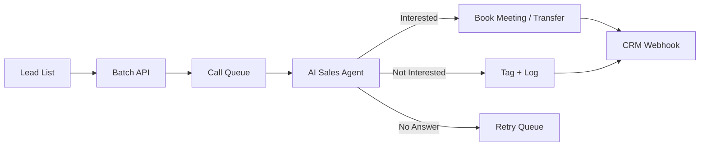

## Overview

Run automated outbound sales campaigns at scale. Upload lead lists, configure AI sales scripts, launch batch calls, and track conversions — all through the API.

---

## Architecture



---

## Step 1: Prepare Campaign Configuration

```bash
# Configure AI sales voice
curl -X PUT https://api.talkos.io/api/config \
  -H "x-api-key: YOUR_KEY" \
  -H "X-Tenant-ID: YOUR_TENANT" \
  -d '{
    "llm": {
      "provider": "groq",
      "model": "llama-3.3-70b-versatile",
      "temperature": 0.8
    },
    "voice": {
      "voiceId": "josh",
      "speed": 1.0,
      "stability": 0.6
    }
  }'
```

## Step 2: Upload Knowledge Base

```bash
curl -X POST https://api.talkos.io/api/knowledge-base \
  -d '{
    "name": "Product Catalogue",
    "content": "## Enterprise Plan\nPrice: $499/mo\nFeatures: Unlimited calls, 10 agents, analytics...\n\n## Starter Plan\nPrice: $99/mo..."
  }'
```

## Step 3: Launch Batch Campaign

```bash
curl -X POST https://api.talkos.io/api/calls/batch \
  -H "x-api-key: YOUR_KEY" \
  -H "X-Tenant-ID: YOUR_TENANT" \
  -d '{
    "calls": [
      {
        "to": "+14155551001",
        "systemPrompt": "You are Alex from TalkOS. You'\''re calling about our AI voice platform. Be enthusiastic but not pushy. Key talking points: 1) Save 60% on support costs, 2) 24/7 availability, 3) 5-minute setup. If interested, offer a demo booking. If not interested, thank them and end politely.",
        "metadata": { "leadId": "lead-001", "company": "Acme Corp", "contactName": "John" },
        "maxDuration": 180
      },
      {
        "to": "+14155551002",
        "systemPrompt": "You are Alex from TalkOS...",
        "metadata": { "leadId": "lead-002", "company": "Widget Inc", "contactName": "Sarah" }
      }
    ],
    "concurrency": 5,
    "retryPolicy": {
      "maxRetries": 2,
      "retryOn": ["no_answer", "busy"],
      "retryDelay": 3600
    }
  }'
```

## Step 4: Monitor Campaign

```bash
# Check batch status
curl https://api.talkos.io/api/calls/batch/BATCH_ID/status

# Real-time monitoring
curl https://api.talkos.io/api/analytics/realtime

# Queue health
curl https://api.talkos.io/api/calls/queue
```

## Step 5: Receive Webhooks

Configure webhooks to update your CRM:

```bash
curl -X POST https://api.talkos.io/api/webhooks/configure \
  -d '{
    "url": "https://your-crm.com/talkos-webhook",
    "events": ["call.ended", "call.transferred"]
  }'
```

**Webhook payload example:**
```json
{
  "event": "call.ended",
  "callUuid": "call-uuid-123",
  "metadata": { "leadId": "lead-001", "company": "Acme Corp" },
  "duration": 145,
  "outcome": "interested",
  "sentiment": 0.7,
  "transcript": "... I'd love to see a demo ...",
  "tags": ["interested", "demo-booked"]
}
```

## Step 6: Analyze Results

```bash
# Campaign analytics
curl "https://api.talkos.io/api/analytics/calls?batchId=BATCH_ID"

# Conversion by tag
curl https://api.talkos.io/api/features/tags/analytics

# Sentiment analysis
curl "https://api.talkos.io/api/analytics/sentiment?dateFrom=2026-02-18"

# Search transcripts for buying signals
curl "https://api.talkos.io/api/transcripts/search?q=interested+demo+pricing"
```

---

## Campaign Optimization Tips

| Strategy | Implementation |
|----------|---------------|
| A/B test scripts | Run 2 batches with different `systemPrompt` |
| Best calling time | Use `GET /api/features/predictions/forecast` |
| Lead scoring | Use `POST /api/features/predictions/churn` for priority |
| Auto-tag outcomes | Set up auto-tagging rules for "interested"/"not-interested" |
| Retry strategy | Configure `retryPolicy` for unmatched calls |

---

## KPIs to Track

| KPI | Target | Measurement |
|-----|--------|-------------|
| Connect Rate | > 40% | Answered calls / total calls |
| Conversation Rate | > 60% | Calls > 30s / answered calls |
| Interest Rate | > 15% | "Interested" tags / conversations |
| Demo Booking Rate | > 8% | Bookings / conversations |
| Average Call Duration | 60-120s | Call analytics |
| Cost per Lead | < $2 | Cost analytics / conversions |
